<h1 align="center"> Awesome Reinforcement Learning  for Cyber Security </h1>

  
  
  
  
  

A curated list of resources dedicated to reinforcement learning applied to cyber security.
Note that the list includes only work that uses reinforcement learning, general machine learning methods applied to cyber security are not included in this list.

For other related curated lists, see :

* [Awesome Machine Learning for Cyber Security](https://github.com/jivoi/awesome-ml-for-cybersecurity)
* [Awesome Adversarial Machine Learning](https://github.com/yenchenlin/awesome-adversarial-machine-learning)

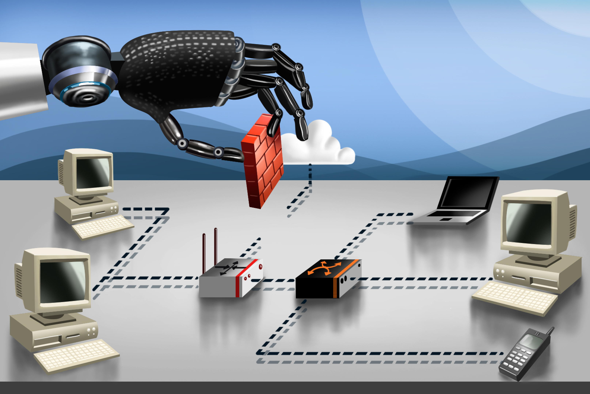

## Table of Contents

 - [RL-Environments](#-environments)
 - [Papers](#-papers)
 - [Books](#-books)
 - [Blogposts](#-miscellaneous)
 - [Talks](#-talks)
 - [Miscellaneous](#-miscellaneous)

## [↑](#table-of-contents) Environments

### `AutoPentest-DRL`
<table>
  <tbody>
    <tr>
      <td width='50%' align='center'>
        
      </td>
      <td width='50%'>
        <a href='https://github.com/crond-jaist/AutoPentest-DRL'>AutoPentest-DRL: Automated Penetration Testing Using Deep Reinforcement Learning</a>
        <ul>
          <li>
            AutoPentest-DRL is an automated penetration testing framework based on Deep Reinforcement Learning (DRL) techniques. AutoPentest-DRL can determine the most appropriate attack path for a given logical network, and can also be used to execute a penetration testing attack on a real network via tools such as Nmap and Metasploit. This framework is intended for educational purposes, so that users can study the penetration testing attack mechanisms. AutoPentest-DRL is being developed by the Cyber Range Organization and Design (<a href="https://www.jaist.ac.jp/misc/crond/index-en.html">CROND</a>) NEC-endowed chair at the Japan Advanced Institute of Science and Technology (<a href="https://www.jaist.ac.jp/english/">JAIST</a>) in Ishikawa,Japan.
          </li>
        </ul>
      </td>
    </tr>
  </tbody>
</table>

### `NASimEmu`
<table>
  <tbody>
    <tr>
      <td width='50%' align='center'>
        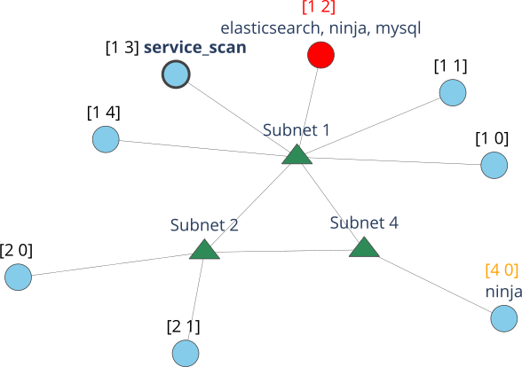
      </td>
      <td width='50%'>
        <a href='https://github.com/jaromiru/NASimEmu'>NASimEmu</a>
        <ul>
          <li>
            NASimEmu is a framework for training deep RL agents in offensive penetration-testing scenarios. It includes both a simulator and an emulator so that a simulation-trained agent can be seamlessly deployed in emulation. Additionally, it includes a random generator that can create scenario instances varying in network configuration and size while fixing certain features, such as exploits and privilege escalations. Furthermore, agents can be trained and tested in multiple scenarios simultaneously.  
            Paper: <a href="https://arxiv.org/abs/2305.17246">(2023) NASimEmu: Network Attack Simulator & Emulator for Training Agents Generalizing to Novel Scenarios</a> 
            Framework: <a href="https://github.com/jaromiru/NASimEmu">NASimEmu</a> 
            Implemented agents: <a href="https://github.com/jaromiru/NASimEmu-agents">NASimEmu-agents</a>
          </li>
        </ul>
      </td>
    </tr>
  </tbody>
</table>

### `gym-idsgame`
<table>
  <tbody>
    <tr>
      <td width='50%' align='center'>
        
      </td>
      <td width='50%'>
        <a href='https://github.com/Limmen/gym-idsgame'>gym-idsgame</a>
        <ul>
          <li>
            An Abstract Cyber Security Simulation and Markov Game for OpenAI Gym.
            Paper: <a href="https://arxiv.org/abs/2009.08120">(2020) Finding Effective Security Strategies through Reinforcement Learning and Self-Play</a>
          </li>
        </ul>
      </td>
    </tr>
  </tbody>
</table>

### `CyberBattleSim` (Microsoft)
<table>
  <tbody>
    <tr>
      <td width='50%' align='center'>
        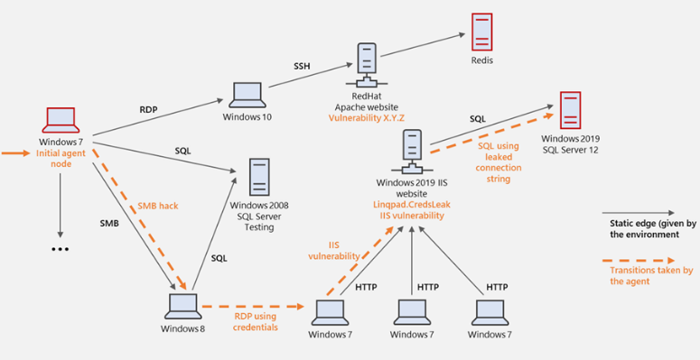
      </td>
      <td width='50%'>
        <a href='https://github.com/microsoft/CyberBattleSim'>CyberBattleSim</a>
        <ul>
          <li>
            CyberBattleSim is an experimentation research platform to investigate the interaction of automated agents operating in a simulated abstract enterprise network environment. The simulation provides a high-level abstraction of computer networks and cyber security concepts. Its Python-based Open AI Gym interface allows for the training of automated agents using reinforcement learning algorithms.
            Blogpost: <a href="https://www.microsoft.com/security/blog/2021/04/08/gamifying-machine-learning-for-stronger-security-and-ai-models/">(2021) Gamifying machine learning for stronger security and AI models</a>
          </li>
        </ul>
      </td>
    </tr>
  </tbody>
</table>

### `gym-malware`
<table>
  <tbody>
    <tr>
      <td width='50%' align='center'>
        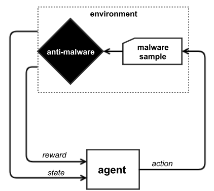
      </td>
      <td width='50%'>
        <a href='https://github.com/endgameinc/gym-malware'>gym-malware</a>
        <ul>
          <li>
            Malware Env for OpenAI Gym
            Paper: <a href="https://arxiv.org/pdf/1801.08917.pdf">(2018) Learning to Evade Static PE Machine Learning Malware Models via Reinforcement Learning</a>
          </li>
        </ul>
      </td>
    </tr>
  </tbody>
</table>

### `malware-rl`
<table>
  <tbody>
    <tr>
      <td width='50%' align='center'>
        
      </td>
      <td width='50%'>
        <a href='https://github.com/bfilar/malware_rl'>malware-rl</a>
        <ul>
          <li>
            Extended and Updated `gym_malware` which supports recent LIEF versionS and an enhanced collection of models (EMBER, MalConv and SOREL-20M)
            Paper: <a href="https://arxiv.org/pdf/1801.08917.pdf">(2018) Learning to Evade Static PE Machine Learning Malware Models via Reinforcement Learning</a>
          </li>
        </ul>
      </td>
    </tr>
  </tbody>
</table>

### `gym-flipit`

<table>
  <tbody>
    <tr>
      <td width='50%' align='center'>
        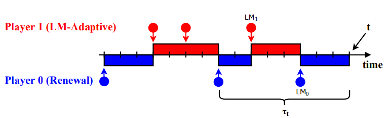
      </td>
      <td width='50%'>
        <a href='https://github.com/lisaoakley/gym-flipit'>gym-flipit</a>
        <ul>
          <li>
            Gym environment for FLIPIT: The Game of "Stealthy Takeover" invented by Marten van Dijk, Ari Juels, Alina Oprea, and Ronald L. Rivest.
            Paper: <a href="https://arxiv.org/abs/1906.11938">(2019) QFlip: An Adaptive Reinforcement Learning Strategy for the FlipIt Security Game</a>
          </li>
        </ul>
      </td>
    </tr>
  </tbody>
</table>

### `gym-threat-defense`

<table>
  <tbody>
    <tr>
      <td width='50%' align='center'>
        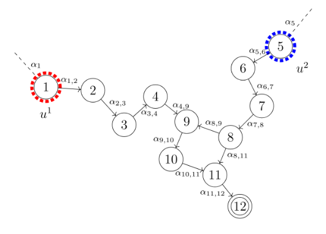
      </td>
      <td width='50%'>
        <a href='https://github.com/hampusramstrom/gym-threat-defense'>gym-threat-defense</a>
        <ul>
          <li>
            Gym environment for the environment described in the paper: <a href="https://dl.acm.org/doi/10.1145/2808475.2808482">(2019) Optimal Defense Policies for Partially Observable Spreading Processes on Bayesian Attack Graphs</a>
          </li>
        </ul>
      </td>
    </tr>
  </tbody>
</table>

### `gym-nasim`

<table>
  <tbody>
    <tr>
      <td width='50%' align='center'>
        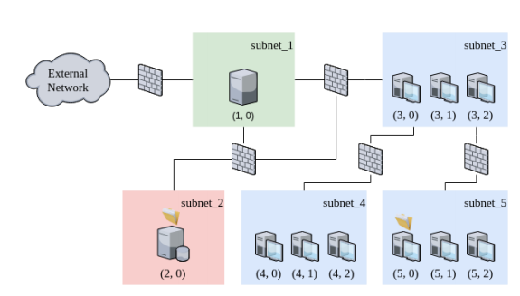
      </td>
      <td width='50%'>
        <a href='https://github.com/Jjschwartz/NetworkAttackSimulator'>gym-nasim</a>
        <ul>
          <li>
            Thesis: <a href="https://arxiv.org/pdf/1905.05965.pdf">(2018) Autonomous Penetration Testing using Reinforcement Learning</a>
          </li>
        </ul>
      </td>
    </tr>
  </tbody>
</table>

### `gym-optimal-intrusion-response`

<table>
  <tbody>
    <tr>
      <td width='50%' align='center'>
        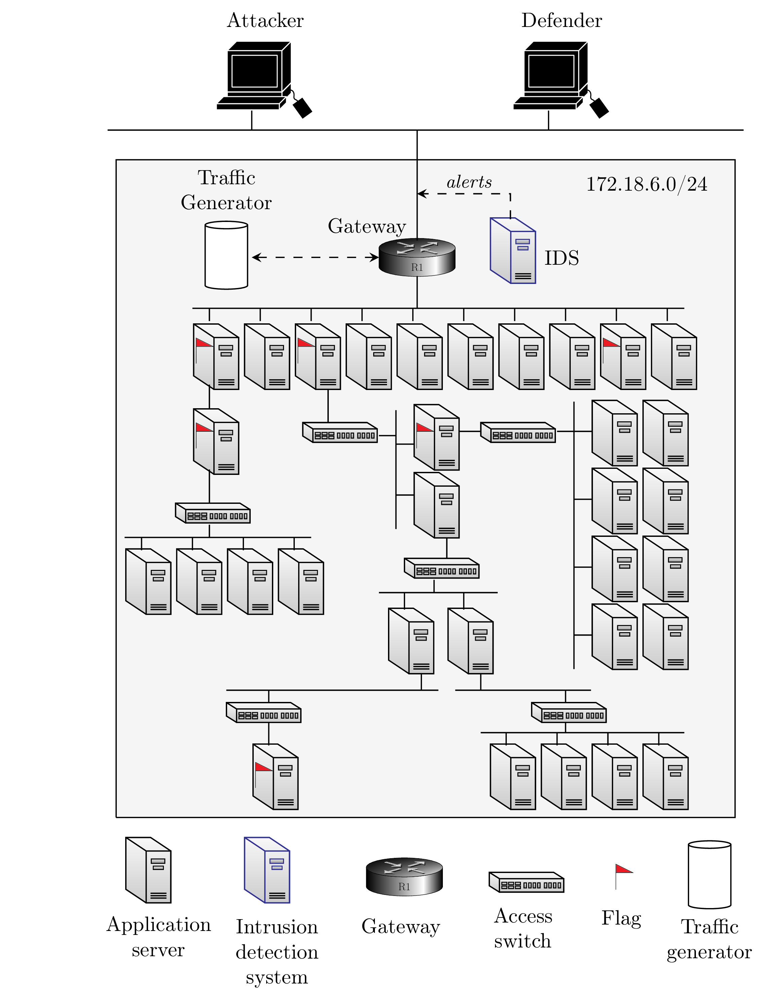
      </td>
      <td width='50%'>
        <a href='https://github.com/Limmen/gym-optimal-intrusion-response'>gym-optimal-intrusion-response</a>
        <ul>
          <li>
          An OpenAI Gym interface to a MDP/Markov Game model for optimal intrusion response of a realistic infrastructure simulated using system traces.
          Paper: <a href="https://arxiv.org/pdf/2106.07160.pdf">(2021) Learning Intrusion Prevention Policies through Optimal Stopping</a>
          </li>
        </ul>
      </td>
    </tr>
  </tbody>
</table>

### `sql_env`

<table>
  <tbody>
    <tr>
      <td width='50%' align='center'>
        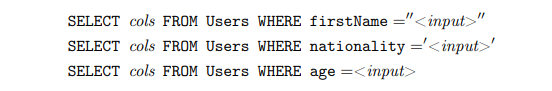
      </td>
      <td width='50%'>
        <a href='https://github.com/manuel-delverme/sql_env'>sql_env</a>
        <ul>
          <li>
          Paper: <a href="https://link.springer.com/chapter/10.1007/978-3-030-91625-1_6">(2021) SQL Injections and Reinforcement Learning: An Empirical Evaluation of the Role of Action Structure</a>
          </li>
        </ul>
      </td>
    </tr>
  </tbody>
</table>

### `cage-challenge`

<table>
  <tbody>
    <tr>
      <td align='center'>
        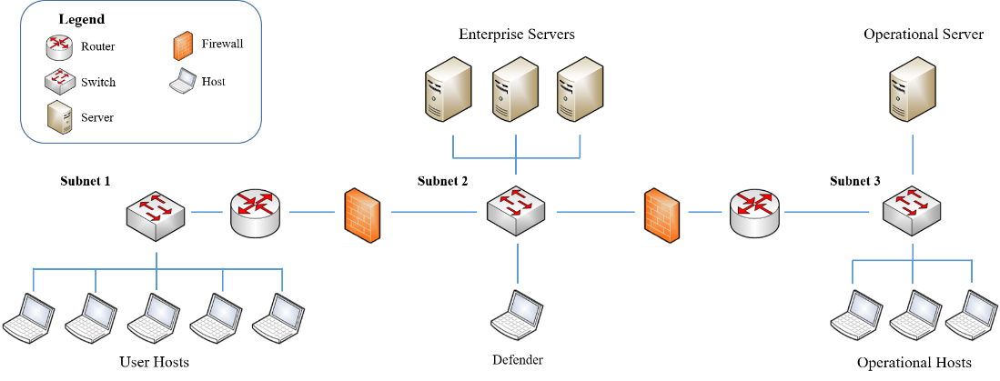
      </td>
    </tr>
    <tr>
      <td >
        <a href='https://github.com/cage-challenge/cage-challenge-1'>cage-challenge-1</a>
        <ul>
          <li>
           The first Cyber Autonomos Gym for Experimentation (CAGE) challenge environment released at the 1st International Workshop on Adaptive Cyber Defense held as part of the 2021 International Joint Conference on Artificial Intelligence (IJCAI).
          </li>
        </ul>
      </td>
    </tr>
    <tr>
  <td >
        <a href='https://github.com/cage-challenge/cage-challenge-2'>cage-challenge-2</a>
        <ul>
          <li>
           The second Cyber Autonomous Gym for Experimentation (CAGE) challenge environment announced at the AAAI-22 Workshop on Artificial Intelligence for Cyber Security Workshop (AICS).
          </li>
        </ul>
      </td>
    </tr>
    <tr>
  <td >
        <a href='https://github.com/cage-challenge/cage-challenge-3'>cage-challenge-3</a>
        <ul>
          <li>
           The third Cyber Autonomous Gym for Experimentation (CAGE) challenge environment.
          </li>
        </ul>
      </td>
    </tr>
  </tbody>
</table>

### `ATMoS`

<table>
  <tbody>
    <tr>
      <td width='50%' align='center'>
        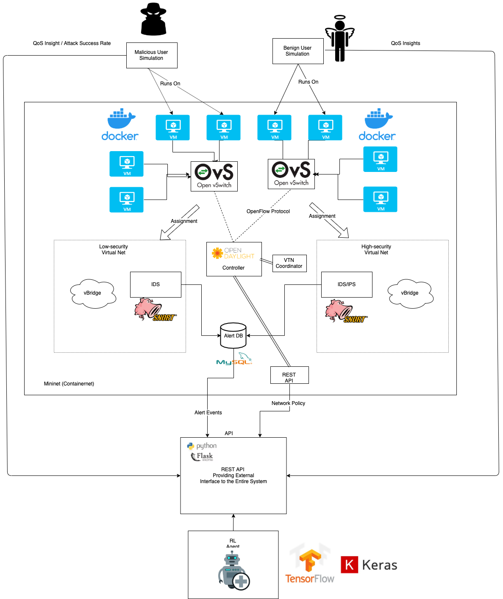
      </td>
      <td width='50%'>
        <a href='https://github.com/ATMoS-Waterloo/ATMoS'>ATMoS</a>
        <ul>
          <li>
          Paper: <a href="https://ieeexplore.ieee.org/document/9110426">(2020) ATMoS: Autonomous Threat Mitigation in SDN using Reinforcement Learning</a>
          </li>
        </ul>
      </td>
    </tr>
  </tbody>
</table>

### `MAB-Malware`

<table>
  <tbody>
    <tr>
      <td width='50%' align='center'>
        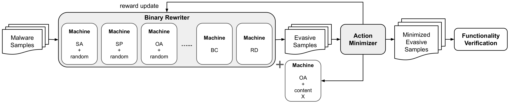
      </td>
      <td width='50%'>
        <a href='https://github.com/weisong-ucr/MAB-malware'>MAB-malware</a>
        <ul>
          <li>
          Paper: <a href="https://arxiv.org/pdf/2003.03100.pdf">(2022) MAB-Malware: A Reinforcement Learning Framework for Attacking Static Malware Classifiers</a>
          </li>
        </ul>
      </td>
    </tr>
  </tbody>
</table>

### `ASAP`

<table>
  <tbody>
    <tr>
      <td width='50%' align='center'>
        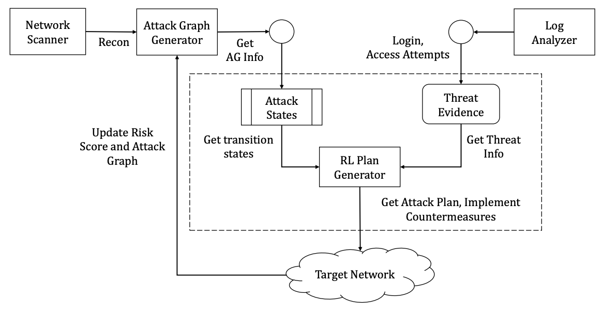
      </td>
      <td width='50%'>
        <a href=https://github.com/ankur8931/asap>Autonomous Security Analysis and Penetration Testing framework (ASAP)</a>
        <ul>
          <li>
          Paper: <a href="https://ieeexplore.ieee.org/document/9394285">(2020) Autonomous Security Analysis and Penetration Testing</a>
          </li>
        </ul>
      </td>
    </tr>
  </tbody>
</table>

### `Yawning Titan`
<table>
  <tbody>
    <tr>
      <td width='50%' align='center'>
        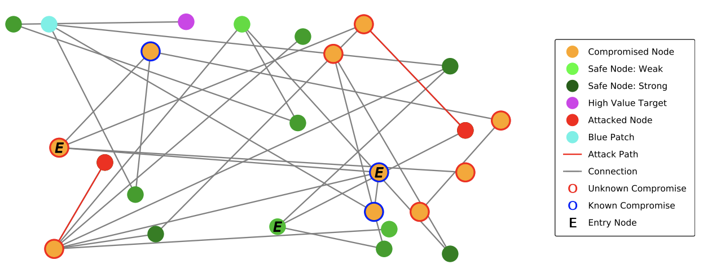
      </td>
      <td width='50%'>
        <a href='https://github.com/dstl/YAWNING-TITAN'>Yawning Titan</a>
        <ul>
          <li>
            Yawning Titan is an abstract, highly flexible, cyber security simulator that is capable of simulating a range of cyber security scenarios.

Paper: <a href="https://www.researchgate.net/publication/361638424_Developing_Optimal_Causal_Cyber-Defence_Agents_via_Cyber_Security_Simulation">(2022) Developing Optimal Causal Cyber-Defence Agents via Cyber Security Simulation</a>
          </li>
        </ul>
      </td>
    </tr>
  </tbody>
</table>

### `Cyborg`

<table>
  <tbody>
    <tr>
      <td width='50%' align='center'>
        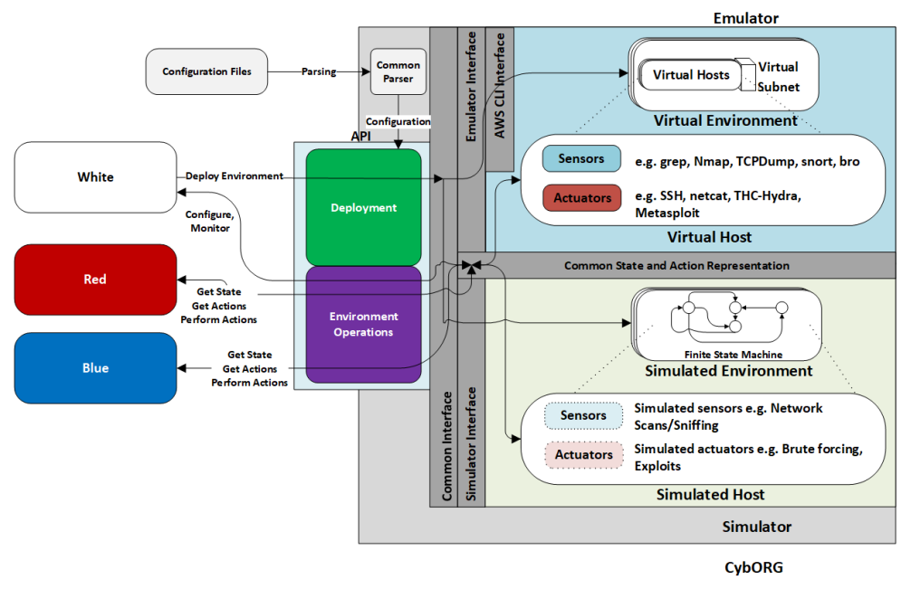
      </td>
      <td width='50%'>
        <a href='https://github.com/cage-challenge/CybORG'>Cyborg</a>
        <ul>
          <li>
            Cyborg is a gym for autonomous cyberg operations research that is driven by the need to efficiently support reinforcement learning to train adversarial decision-making models through simulation and emulation. This is a variation of the environments used by cage-challenge above.

Paper: <a href="https://arxiv.org/abs/2108.09118">(2021) CybORG: A Gym for the Development of Autonomous Cyber Agents </a>
          </li>
        </ul>
      </td>
    </tr>
  </tbody>
</table>

### `FARLAND`

<table>
  <tbody>
    <tr>
      <td width='50%' align='center'>
        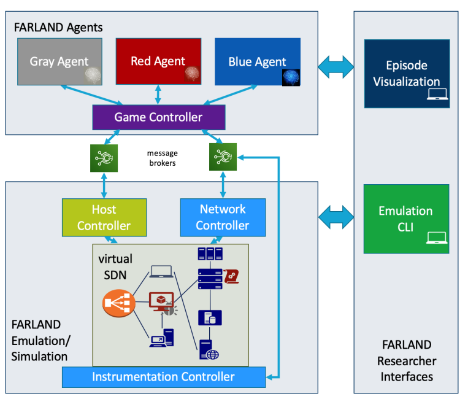
      </td>
      <td width='50%'>
        FARLAND (github repository missing)
        <ul>
          <li>
            FARLAND is a framework for advanced Reinforcement Learning for autonomous network defense, that uniquely enables the design of network environments to gradually increase the complexity of models, providing a path for autonomous agents to increase their performance from apprentice to superhuman level, in the task of reconfiguring networks to mitigate cyberattacks.

Paper: <a href="https://arxiv.org/pdf/2103.07583.pdf">(2021) Network Environment Design for Autonomous Cyberdefense </a>
          </li>
        </ul>
      </td>
    </tr>
  </tbody>
</table>

### `SecureAI`
<table>
  <tbody>
    <tr>
      <td width='50%' align='center'>
        
      </td>
      <td width='50%'>
        <a href='https://github.com/ansi-code/secureai-java'>SecureAI</a>
        <ul>
          <li>
            SecureAI: Deep Reinforcement Learning for Self-Protection in Non-Stationary Cloud Architectures
			Paper: <a href="https://ieeexplore.ieee.org/stamp/stamp.jsp?tp=&arnumber=9659882">(2021) An Intrusion Response Approach for Elastic Applications Based on Reinforcement Learning</a>
          </li>
        </ul>
      </td>
    </tr>
  </tbody>
</table>

### `CYST`
<table>
  <tbody>
    <tr>
      <td width='50%' align='center'>
        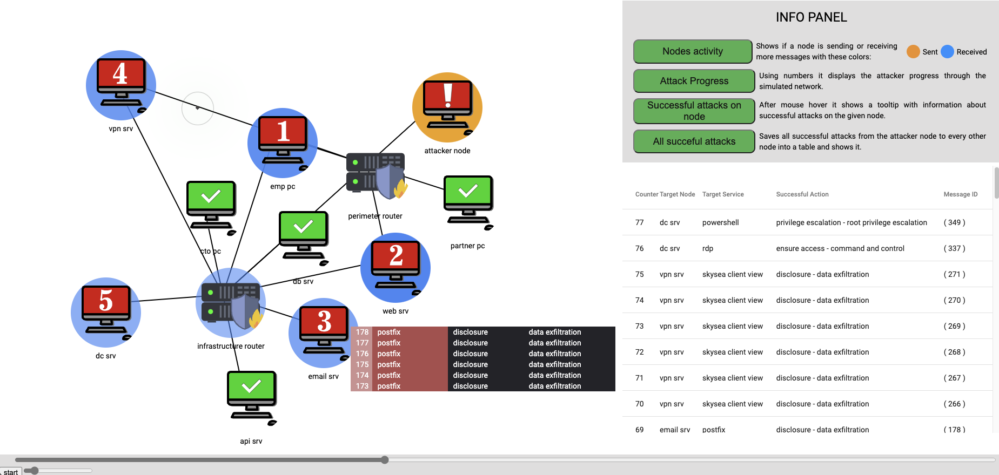
      </td>
      <td width='50%'>
        <a href='https://muni.cz/go/cyst-user'>CYST</a>
        <ul>
          <li>
            CYST is a multi-agent discrete-event simulation framework tailored for cybersecurity domain. Its goal is to enable high-throughput and realistic simulation of cybersecurity interactions in arbitrary infrastructures.   
			Paper: <a href="https://ieeexplore.ieee.org/abstract/document/9213690">(2020) Session-level Adversary Intent-Driven Cyberattack Simulator</a> 
      Code: <a href="https://gitlab.ics.muni.cz/cyst-public/cyst-core/">HERE</a>
          </li>
        </ul>
      </td>
    </tr>
  </tbody>
</table>

### `CLAP`
<table>
  <tbody>
    <tr>
      <td width='50%' align='center'>
        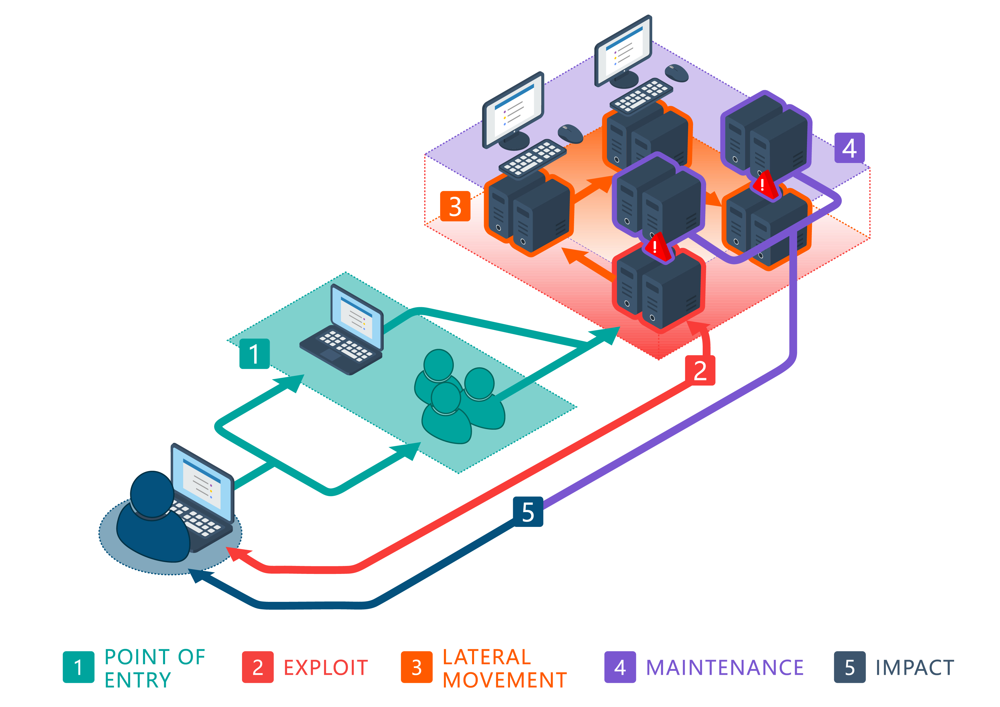
      </td>
      <td width='50%'>
        <a href='https://github.com/yyzpiero/RL4RedTeam'>CLAP: Curiosity-Driven Reinforcment Learning Automatic Penetration Testing Agent</a>
        <ul>
          <li>
            CLAP is a reinforcement learning PPO agent performs Penetration Testing in simulated computer network environment (we use Network Attack Simulator (NASim)). The agent is trained to scan for vulnerabilities in the network and exploit them to gain access to various network resources.    
			Paper: <a href="https://arxiv.org/abs/2202.10630">(2022) Behaviour-Diverse Automatic Penetration Testing: A Curiosity-Driven Multi-Objective Deep Reinforcement Learning Approach</a> 
      Code: <a href="https://github.com/yyzpiero/RL4RedTeam">HERE</a>
          </li>
        </ul>
      </td>
    </tr>
  </tbody>
</table>

## [↑](#table-of-contents) Papers

### Surveys
* [(2023) Automated Cyber Defence: A Review](https://arxiv.org/pdf/2303.04926.pdf)
* [(2022) The Confluence of Networks, Games, and Learning a Game-Theoretic Framework for Multiagent Decision Making Over Networks](https://arxiv.org/abs/2105.08158)
* [(2022) Cyber-security and reinforcement learning — A brief survey](https://www.sciencedirect.com/science/article/pii/S0952197622002512)
* [(2022) Blockchain and Federated Deep Reinforcement Learning Based Secure Cloud-Edge-End Collaboration in Power IoT](https://ieeexplore.ieee.org/stamp/stamp.jsp?tp=&arnumber=9801730)
* [(2022) Deep Reinforcement Learning for Cybersecurity Threat Detection and Protection: A Review](https://arxiv.org/pdf/2206.02733.pdf)
* [(2022) Research and Challenges of Reinforcement Learning in Cyber Defense Decision-Making for Intranet Security](https://www.mdpi.com/1999-4893/15/4/134)
* [(2021) Reinforcement Learning for Feedback-Enabled Cyber Resilience](https://arxiv.org/pdf/2107.00783.pdf)
* [(2021) Prospective Artificial Intelligence Approaches for Active Cyber Defence](https://arxiv.org/pdf/2104.09981.pdf)
* [(2019) Deep Reinforcement Learning for Cyber Security](https://arxiv.org/abs/1906.05799)

### Demonstration papers
* [(2023) The Cyber Security Learning Environment (CSLE) v.0.2.0 Demo](https://www.youtube.com/watch?v=iE2KPmtIs2A)
* [(2022) A System for Interactive Examination of Learned Security Policies](https://ieeexplore.ieee.org/document/9789707) [**(VIDEO)**](https://www.youtube.com/watch?v=18P7MjPKNDg)

### Position papers
* [(2023) Autonomous Cyber Defence: A roadmap from lab to ops](https://cetas.turing.ac.uk/sites/default/files/2023-06/autonomous_cyber_defence_final_report.pdf)
* [(2022) The Mathematics of Cyber Defense](https://www.ams.org/journals/notices/202206/rnoti-p1019.pdf)

### Regular Papers
* [(2023) A Reinforcement Learning Approach to Undetectable Attacks against Automatic Generation Control](https://ieeexplore.ieee.org/stamp/stamp.jsp?arnumber=10159364)
* [(2023) Digital Twins for Security Automation](https://ieeexplore.ieee.org/abstract/document/10154288)
* [(2023) Inroads into Autonomous Network Defence using Explained Reinforcement Learning](https://arxiv.org/pdf/2306.09318v1.pdf)
* [(2023) Automated Adversary-in-the-Loop Cyber-Physical Defense Planning](https://dl.acm.org/doi/pdf/10.1145/3596222)
* [(2023) RLAuth: A Risk-based Authentication System using Reinforcement Learning](https://ieeexplore.ieee.org/stamp/stamp.jsp?tp=&arnumber=10151855)
* [(2023) SQIRL: Grey-Box Detection of SQL Injection Vulnerabilities Using Reinforcement Learning](http://www.doc.ic.ac.uk/~maffeis/papers/usenix23.pdf)
* [(2023) Dual Reinforcement Learning based Attack Path Prediction for 5G Industrial Cyber-Physical Systems](https://ieeexplore.ieee.org/abstract/document/10149069)
* [(2023) Detecting State of Charge False Reporting Attacks via Reinforcement Learning Approach](https://ieeexplore.ieee.org/abstract/document/10149139)
* [(2023) Learning to Defend by Attacking (and Vice-Versa): Transfer of Learning in Cybersecurity Games](https://arxiv.org/pdf/2306.02165.pdf)
* [(2023) NASimEmu: Network Attack Simulator & Emulator for Training Agents Generalizing to Novel Scenarios](https://arxiv.org/abs/2305.17246)
* [(2023) A Collaborative Stealthy DDoS Detection Method based on Reinforcement Learning at the Edge of the Internet of Things](https://ieeexplore.ieee.org/stamp/stamp.jsp?tp=&arnumber=10133833)
* [(2023) An Intelligent SDWN Routing Algorithm Based on Network Situational Awareness and Deep Reinforcement Learning](https://arxiv.org/pdf/2305.10441.pdf)
* [(2023) Trojan Playground: A Reinforcement Learning Framework for Hardware Trojan Insertion and Detection](https://arxiv.org/pdf/2305.09592.pdf)
* [(2023) Decentralized Anomaly Detection in Cooperative Multi-Agent Reinforcement Learning](https://people.kth.se/~gyuri/Pub/KazariSD-DistributedDetectionMARL-IJCAI23.pdf)
* [(2023) Evolved Prevention Strategies for 6G Networks through Stochastic Games and Reinforcement Learning](https://ieeexplore.ieee.org/stamp/stamp.jsp?tp=&arnumber=10115274)
* [(2023) Cyber Attack Detection Using Bellman Optimality Equation in Reinforcement Learning](https://www.atlantis-press.com/article/125986296.pdf)
* [(2023) Greybox Penetration Testing on Cloud Access Control with IAM Modeling and Deep Reinforcement Learning](https://arxiv.org/pdf/2304.14540.pdf)
* [(2023) A Multiagent CyberBattleSim for RL Cyber Operation Agents](https://arxiv.org/pdf/2304.11052.pdf)
* [(2023) Reinforcement Learning Solution for Cyber-Physical Systems Security Against Replay Attacks](https://ieeexplore.ieee.org/stamp/stamp.jsp?tp=&arnumber=10105656)
* [(2023) AIRS: Explanation for Deep Reinforcement Learning based Security Applications](https://www.usenix.org/system/files/sec23fall-prepub-36-yu-jiahao.pdf)
* [(2023) SSQLi: A Black-Box Adversarial Attack Method for SQL Injection Based on Reinforcement Learning](https://www.mdpi.com/1999-5903/15/4/133)
* [(2023) On the use of Reinforcement Learning for Attacking and Defending Load Frequency Control](https://arxiv.org/pdf/2303.15736.pdf)
* [(2023) An Optimal Active Defensive Security Framework for the Container-Based Cloud with Deep Reinforcement Learning](https://www.mdpi.com/2079-9292/12/7/1598)
* [(2023) AutoCAT: Reinforcement Learning for Automated Exploration of Cache-Timing Attacks](https://hsienhsinlee.github.io/MARS/pub/hpca2023.pdf)
* [(2023) Applying Reinforcement Learning for Enhanced Cybersecurity against Adversarial Simulation](https://www.mdpi.com/1424-8220/23/6/3000)
* [(2023) Offline RL+CKG: A hybrid AI model for cybersecurity tasks](https://ebiquity.umbc.edu/_file_directory_/papers/1180.pdf)
* [(2023) Learning automated defense strategies using graph-based cyber attack simulations](https://www.ndss-symposium.org/wp-content/uploads/2023/02/wosoc2023_nyberg_graphsim.pdf)
* [(2023) Cyber Automated Network Resilience Defensive Approach against Malware Images](https://ieeexplore.ieee.org/abstract/document/10043078)
* [(2023) Energy scheduling for DoS attack over multi-hop networks: Deep reinforcement learning approach](https://www.sciencedirect.com/science/article/pii/S0893608023000916)
* [(2023) Cybersecurity as a Tic-Tac-Toe Game Using Autonomous Forwards (Attacking) And Backwards (Defending) Penetration Testing in a Cyber Adversarial Artificial Intelligence System](https://ieeexplore.ieee.org/document/10034922)
* [(2023) Deep Reinforcement Learning for Cyber System Defense under Dynamic Adversarial Uncertainties](https://arxiv.org/pdf/2302.01595.pdf)
* [(2023) Catch Me If You Can: Improving Adversaries in Cyber-Security With Q-Learning Algorithms](https://www.researchgate.net/publication/368330555_Catch_Me_If_You_Can_Improving_Adversaries_in_Cyber-Security_With_Q-Learning_Algorithms/references)
* [(2023) Security Analysis of Cyber-Physical Systems Using Reinforcement Learning](https://www.mdpi.com/1424-8220/23/3/1634)
* [(2023) Beyond von Neumann Era: Brain-inspired Hyperdimensional Computing to the Rescue](https://dl.acm.org/doi/pdf/10.1145/3566097.3568354)
* [(2023) Increasing attacker engagement on SSH honeypots using semantic embeddings of cyber-attack patterns and deep reinforcement learning](https://ieeexplore.ieee.org/stamp/stamp.jsp?tp=&arnumber=10022206)
* [(2023) Towards Dynamic Capture-The-Flag Training Environments For Reinforcement Learning Offensive Security Agents](https://ieeexplore.ieee.org/abstract/document/10020389)
* [(2023) Leveraging Deep Reinforcement Learning for Automating Penetration Testing in Reconnaissance and Exploitation Phase](https://ieeexplore.ieee.org/stamp/stamp.jsp?tp=&arnumber=10013801)
* [(2023) HAXSS: Hierarchical Reinforcement Learning for XSS Payload Generation](http://wwwhomes.doc.ic.ac.uk/~maffeis/papers/trustcom22.pdf)
* [(2023) A Transfer Double Deep Q Network Based DDoS Detection Method for Internet of Vehicles](https://ieeexplore.ieee.org/stamp/stamp.jsp?tp=&arnumber=10005139)
* [(2022) DRAGON: Deep Reinforcement Learning for Autonomous Grid Operation and Attack Detection](https://dl.acm.org/doi/10.1145/3564625.3567969)
* [(2022) A Model-Free Approach to Intrusion Response Systems](https://www.sciencedirect.com/science/article/pii/S2214212622000400)
* [(2022) Reinforcement Learning Agents for Simulating Normal and Malicious Actions in Cyber Range Scenarios](https://ceur-ws.org/Vol-3260/paper1.pdf)
* [(2022) Sequential Topology Attack of Supply Chain Networks Based on Reinforcement Learning](https://ieeexplore.ieee.org/abstract/document/9970706)
* [(2022) Defend to Defeat: Limiting Information Leakage in Defending against Advanced Persistent Threats](https://ieeexplore.ieee.org/abstract/document/9987540)
* [(2022) How to Attack and Defend NextG Radio Access Network Slicing with Reinforcement Learning](https://ieeexplore.ieee.org/stamp/stamp.jsp?arnumber=9984930)
* [(2022) Knowledge Guided Two-player Reinforcement Learning for Cyber Attacks and Defenses](https://ebiquity.umbc.edu/_file_directory_/papers/1173.pdf)
* [(2022) Beyond CAGE: Investigating Generalization of Learned Autonomous Network Defense Policies](https://arxiv.org/pdf/2211.15557.pdf)
* [(2022) Bridging Automated to Autonomous Cyber Defense: Foundational Analysis of Tabular Q-Learning.](https://dl.acm.org/doi/pdf/10.1145/3560830.3563732)
* [(2022) Cascaded Reinforcement Learning Agents for Large Action Spaces in Autonomous Penetration Testing.](https://www.mdpi.com/2076-3417/12/21/11265)
* [(2022) Model-Free Deep Reinforcement Learning in Software-Defined Networks.](https://www.semanticscholar.org/reader/fd2fc84bc8366962b90c1c8228ff12ad17154cbb)
* [(2022) Hierarchical reinforcement learning guidance with threat avoidance.](https://ieeexplore.ieee.org/stamp/stamp.jsp?arnumber=9940160)
* [(2022) Exposing Surveillance Detection Routes via Reinforcement Learning, Attack Graphs, and Cyber Terrain.](https://arxiv.org/pdf/2211.03027.pdf)
* [(2022) Cognitive Models of Dynamic Decisions in Autonomous Intelligent Cyber Defense.](https://www.researchgate.net/profile/Baptiste-Prebot/publication/364965185_Cognitive_Models_of_Dynamic_Decisions_in_Autonomous_Intelligent_Cyber_Defense/links/636165142f4bca7fd0229e7b/Cognitive-Models-of-Dynamic-Decisions-in-Autonomous-Intelligent-Cyber-Defense.pdf)
* [(2022) Optimizing cybersecurity incident response decisions using deep reinforcement learning.](https://ijece.iaescore.com/index.php/IJECE/article/view/28164/16141)
* [(2022) Robust Moving Target Defense against Unknown Attacks: A Meta-Reinforcement Learning Approach](https://www.cs.tulane.edu/~zzheng3/publication/metaRL-MTD.pdf)
* [(2022) Learning Games for Defending Advanced Persistent Threats in Cyber Systems](https://ieeexplore.ieee.org/abstract/document/9923774)
* [(2022) IEEE P2668-Compliant Multi-Layer IoT-DDoS Defense System Using Deep Reinforcement Learning](https://ieeexplore.ieee.org/stamp/stamp.jsp?tp=&arnumber=9916301)
* [(2022) Privacy-Enhanced Intrusion Detection and Defense for Cyber-Physical Systems: A Deep Reinforcement Learning Approach](https://downloads.hindawi.com/journals/scn/2022/4996427.pdf)
* [(2022) DeepThrottle: Deep Reinforcement Learning for Router Throttling to Defend Against DDoS Attack in SDN](https://ieeexplore.ieee.org/stamp/stamp.jsp?tp=&arnumber=9894298)
* [(2022) Breakthrough to Adaptive and Cost-Aware Hardware-Assisted Zero-Day Malware Detection: A Reinforcement Learning-Based Approach](https://www.researchgate.net/profile/Zhangying-He/publication/364290246_Breakthrough_to_Adaptive_and_Cost-Aware_Hardware-Assisted_Zero-Day_Malware_Detection_A_Reinforcement_Learning-Based_Approach/links/634384d82752e45ef6a78bc6/Breakthrough-to-Adaptive-and-Cost-Aware-Hardware-Assisted-Zero-Day-Malware-Detection-A-Reinforcement-Learning-Based-Approach.pdf)
* [(2022) Mitigating Jamming Attack in 5G Heterogeneous Networks: A Federated Deep Reinforcement Learning Approach](https://ieeexplore.ieee.org/abstract/document/9914678)
* [(2022) Deep Reinforcement Learning based Evasion Generative Adversarial Network for Botnet Detection](https://arxiv.org/pdf/2210.02840.pdf)
* [(2022) Adaptive threat mitigation in SDN using improved D3QN](https://www.spiedigitallibrary.org/conference-proceedings-of-spie/12339/1233911/Adaptive-threat-mitigation-in-SDN-using-improved-D3QN/10.1117/12.2652679.full?SSO=1)
* [(2022) A Comprehensive Survey on Security Attacks to Edge Server of IoT Devices through Reinforcement Learning](https://www.researchgate.net/profile/Anit-Kumar-6/publication/363832239_A_Comprehensive_Survey_on_Security_Attacks_to_Edge_Server_of_IoT_Devices_through_Reinforcement_Learning/links/632ffdab86b22d3db4de4061/A-Comprehensive-Survey-on-Security-Attacks-to-Edge-Server-of-IoT-Devices-through-Reinforcement-Learning.pdf)
* [(2022) Smart Grid Worm Detection Based on Deep Reinforcement Learning](https://ieeexplore.ieee.org/stamp/stamp.jsp?tp=&arnumber=9880818)
* [(2022) Deep reinforcement learning based IRS-assisted mobile edge computing under physical-layer security](https://www.sciencedirect.com/science/article/pii/S1874490722001732)
* [(2022) Reinforcement Learning for Intrusion Detection: More Model Longness and Fewer Updates](https://ieeexplore.ieee.org/stamp/stamp.jsp?arnumber=9893186)
* [(2022) AutoDefense: Reinforcement Learning Based Autoreactive Defense Against Network Attacks](https://cs.ucf.edu/~mohaisen/doc/cns22.pdf)
* [(2022) ProAPT: Projection of APT Threats with Deep Reinforcement Learning](https://arxiv.org/pdf/2209.07215.pdf)
* [(2022) Reinforced Transformer Learning for VSI-DDoS Detection in Edge Clouds](https://ieeexplore.ieee.org/document/9878326/)
* [(2022) H4rm0ny: A Competitive Zero-Sum Two-Player Markov Game for Multi-Agent Learning on Evasive Malware Generation and Detection](https://ieeexplore.ieee.org/stamp/stamp.jsp?tp=&arnumber=9850345)
* [(2022) Reinforcement Learning for Hardware Security: Opportunities, Developments, and Challenges](https://arxiv.org/pdf/2208.13885.pdf)
* [(2022) Attrition: Attacking Static Hardware Trojan Detection Techniques Using Reinforcement Learning](https://arxiv.org/pdf/2208.12897.pdf)
* [(2022) Deep Reinforcement Learning in the Advanced Cybersecurity Threat Detection and Protection](https://link.springer.com/article/10.1007/s10796-022-10333-x)
* [(2022) ReCEIF: Reinforcement Learning-Controlled Effective Ingress Filtering](https://www.computer.org/csdl/proceedings-article/lcn/2022/09843478/1G9C5AMjieI)
* [(2022) AutoCAT: Reinforcement Learning for Automated Exploration of Cache-Timing Attacks](https://arxiv.org/pdf/2208.08025.pdf)
* [(2022) GPDS: A multi-agent deep reinforcement learning game for anti-jamming secure computing in MEC network](https://www.sciencedirect.com/science/article/pii/S0957417422015044)
* [(2022) Reinforcement Learning based Adversarial Malware Example Generation Against Black-Box Detectors](https://www.sciencedirect.com/science/article/pii/S0167404822002632)
* [(2022) SAC-AP: Soft Actor Critic based Deep Reinforcement Learning for Alert Prioritization](https://arxiv.org/pdf/2207.13666.pdf)
* [(2022) How to Mitigate DDoS Intelligently in SD-IoV: A Moving Target Defense Approach](https://ieeexplore.ieee.org/stamp/stamp.jsp?tp=&arnumber=9829332)
* [(2022) ReLFA: Resist Link Flooding Attacks via Renyi Entropy and Deep Reinforcement Learning in SDN-IoT](https://ieeexplore.ieee.org/stamp/stamp.jsp?tp=&arnumber=9837856)
* [(2022) An Artificial Intelligence-Enabled Framework for Optimizing the Dynamic Cyber Vulnerability Management Process](https://arxiv.org/pdf/2208.02369.pdf)
* [(2022) Eavesdropping Game Based on Multi-Agent Deep Reinforcement Learning](https://ieeexplore.ieee.org/abstract/document/9833927)
* [(2022) A Hidden Attack Sequences Detection Method Based on Dynamic Reward Deep Deterministic Policy Gradient](https://www.hindawi.com/journals/scn/2022/1488344/)
* [(2022) Security State Estimation for Cyber-Physical Systems against DoS Attacks via Reinforcement Learning and Game Theory](https://www.mdpi.com/2076-0825/11/7/192)
* [(2022) Developing Optimal Causal Cyber-Defence Agents via Cyber Security Simulation](https://www.researchgate.net/publication/361638424_Developing_Optimal_Causal_Cyber-Defence_Agents_via_Cyber_Security_Simulation)
* [(2022) Enabling intrusion detection systems with dueling double deep Q-learning](https://www.emerald.com/insight/content/doi/10.1108/DTS-05-2022-0016/full/pdf?title=enabling-intrusion-detection-systems-with-dueling-double-deep-italicqitalic-learning)
* [(2022) MultiAgent Deep Reinforcement LearningDriven Mitigation of Adverse Effects of CyberAttacks on Electric Vehicle Charging Station](https://arxiv.org/pdf/2207.07041.pdf)
* [(2022) XSS Adversarial Example Attacks Based on Deep Reinforcement Learning](https://www.sciencedirect.com/science/article/pii/S0167404822002255)
* [(2022) Analyzing Multi-Agent Reinforcement Learning and Coevolution in Cybersecurity](https://dl.acm.org/doi/pdf/10.1145/3512290.3528844)
* [(2022) AlphaSOC: Reinforcement Learning-based Cybersecurity Automation for Cyber-Physical Systems](https://ieeexplore.ieee.org/abstract/document/9797597?casa_token=CLYC6uNfXhgAAAAA:t8ohceSJb-eI-NeyhUFtizY_786VsCnFfLDe_zAh33be__HI31foWepaXvIhQ4PCF69_s3Vm)
* [(2022) Online Cyber-Attack Detection in the Industrial Control System: A Deep Reinforcement Learning Approach](https://www.hindawi.com/journals/mpe/2022/2280871/)
* [(2022) Detecting Cyber Attacks: A Reinforcement Learning Based Intrusion Detection System](https://ieeexplore.ieee.org/stamp/stamp.jsp?tp=&arnumber=9813892)
* [(2022) Robust Enhancement of Intrusion Detection Systems using Deep Reinforcement Learning and Stochastic Game](https://ieeexplore.ieee.org/abstract/document/9809923)
* [(2022) irs-partition: An Intrusion Response System utilizing Deep Q-Networks and system partitions](https://www.sciencedirect.com/science/article/pii/S2352711022000796)
* [(2022) Defensive deception framework against reconnaissance attacks in the cloud with deep reinforcement learning](http://scis.scichina.com/en/2022/170305.pdf)
* [(2022) Captcha me if you can: Imitation Games with Reinforcement Learning](https://ieeexplore.ieee.org/stamp/stamp.jsp?tp=&arnumber=9797367)
* [(2022) Deep-Reinforcement-Learning-Based QoS-Aware Secure Routing for SDN-IoT](https://ieeexplore.ieee.org/stamp/stamp.jsp?tp=&arnumber=8935210)
* [(2022) A generic scheme for cyber security in resource constraint network using incomplete information game](https://link.springer.com/content/pdf/10.1007/s12065-021-00684-w.pdf)
* [(2022) A Layered Reference Model for Penetration Testing with Reinforcement Learning and Attack Graphs](https://arxiv.org/pdf/2206.06934.pdf)
* [(2022) A flexible SDN-based framework for slow-rate DDoS attack mitigation by using deep reinforcement learning](https://www.sciencedirect.com/science/article/pii/S1084804522000960)
* [(2022) Learning Security Strategies through Game Play and Optimal Stopping](https://arxiv.org/abs/2205.14694)
* [(2022) Resilient Optimal Defensive Strategy of Micro-Grids System via Distributed Deep Reinforcement Learning Approach Against FDI Attack](https://ieeexplore.ieee.org/abstract/document/9783467)
* [(2022) Data-driven Cyber-attack Detection of Intelligent Attacks in Islanded DC Microgrids](https://ieeexplore.ieee.org/abstract/document/9782082)
* [(2022) Multiple Domain Cyberspace Attack and Defense Game Based on Reward Randomization Reinforcement Learning](https://arxiv.org/pdf/2205.10990.pdf)
* [(2022) Cyber threat response using reinforcement learning in graph-based attack simulations](https://ieeexplore.ieee.org/abstract/document/9789835)
* [(2022) Intrusion Prevention through Optimal Stopping](https://ieeexplore.ieee.org/document/9779345)
* [(2022) Learning to Play an Adaptive Cyber Deception Game](https://optlearnmas22.github.io/files/paper10.pdf)
* [(2022) Neural Fictitious Self-Play for Radar Anti-Jamming Dynamic Game with Imperfect Information](https://ieeexplore.ieee.org/stamp/stamp.jsp?tp=&arnumber=9775208)
* [(2022) A Reinforcement Learning Approach for Defending Against Multi-Scenario Load Redistribution Attacks](https://ieeexplore.ieee.org/abstract/document/9776523)
* [(2022) A Proactive Eavesdropping Game in MIMO systems Based on Multi-Agent Deep Reinforcement Learning](https://ieeexplore.ieee.org/abstract/document/977039)
* [(2022) FEAR: Federated Cyber-Attack Reaction in Distributed Software-Defined Networks with Deep Q-Network](https://ieeexplore.ieee.org/abstract/document/9768169)
* [(2022) EvadeRL: Evading PDF Malware Classifiers with Deep Reinforcement Learning](https://www.hindawi.com/journals/scn/2022/7218800/)
* [(2022) Link: Black-Box Detection of Cross-Site Scripting Vulnerabilities Using Reinforcement Learning](https://dl.acm.org/doi/pdf/10.1145/3485447.3512234)
* [(2022) MERLIN - Malware Evasion with Reinforcement LearnINg](https://arxiv.org/pdf/2203.12980.pdf)
* [(2022) DeepAir: Deep Reinforcement Learning for Adaptive Intrusion Response in Software-Defined Networks](https://ieeexplore.ieee.org/stamp/stamp.jsp?tp=&arnumber=9732448)
* [(2022) DroidRL: Reinforcement Learning Driven Feature Selection for Android Malware Detection](https://arxiv.org/pdf/2203.02719.pdf)
* [(2022) MAB-Malware: A Reinforcement Learning Framework for Attacking Static Malware Classifiers](https://arxiv.org/pdf/2003.03100.pdf)
* [(2022) Behaviour-Diverse Automatic Penetration Testing: A Curiosity-Driven Multi-Objective Deep Reinforcement Learning Approach](https://arxiv.org/pdf/2202.10630.pdf)
* [(2022) Safe Exploration in Wireless Security: A Safe Reinforcement Learning Algorithm with Hierarchical Structure](https://ieeexplore.ieee.org/stamp/stamp.jsp?tp=&arnumber=9705557)
* [(2022) Discovering Exfiltration Paths Using Reinforcement Learning with Attack Graphs](https://arxiv.org/pdf/2201.12416.pdf)
* [(2022) Multi-Agent Reinforcement Learning for Decentralized Resilient Secondary Control of Energy Storage Systems against DoS Attacks](https://ieeexplore.ieee.org/stamp/stamp.jsp?tp=&arnumber=9676705)
* [(2021) Network defense decision-making based on a stochastic game system and a deep recurrent Q-network](https://www.sciencedirect.com/science/article/pii/S0167404821003047)
* [(2021) Discovering reflected cross-site scripting vulnerabilities using a multiobjective reinforcement learning environment](https://www.sciencedirect.com/science/article/pii/S0167404821003679)
* [(2021) Enhancing the insertion of NOP instructions to obfuscate malware via deep reinforcement learning](https://www.sciencedirect.com/science/article/pii/S0167404821003679)
* [(2021) Automating post-exploitation with deep reinforcement learning](https://www.sciencedirect.com/science/article/pii/S0167404820303813)
* [(2021) Moving Target Defense as a Proactive Defense Element for Beyond 5G](https://ieeexplore.ieee.org/document/9579381)
* [(2021) Network Resilience Under Epidemic Attacks: Deep Reinforcement Learning Network Topology Adaptations](https://ieeexplore.ieee.org/stamp/stamp.jsp?tp=&arnumber=9686036)
* [(2021) An Intrusion Response Approach for Elastic Applications Based on Reinforcement Learning](https://ieeexplore.ieee.org/abstract/document/9659882)
* [(2021) Reinforcement Learning-assisted Threshold Optimization for Dynamic Honeypot Adaptation to Enhance IoBT Networks Security](https://ieeexplore.ieee.org/abstract/document/9660066)
* [(2021) Reinforcement Learning-based Hierarchical Seed Scheduling for Greybox Fuzzing](https://www.cs.ucr.edu/~heng/pubs/afl-hier.pdf)
* [(2021) SquirRL: Automating Attack Analysis on Blockchain Incentive Mechanisms with Deep Reinforcement Learning](https://www.ndss-symposium.org/wp-content/uploads/ndss2021_3C-4_24188_paper.pdf)
* [(2021) Reinforcement Learning for the Problem of Detecting Intrusion in a Computer System](https://link.springer.com/chapter/10.1007/978-981-16-2380-6_66)
* [(2021) Timing Strategy for Active Detection of APT Attack Based on FlipIt Model and Q-learning Method](https://ieeexplore.ieee.org/stamp/stamp.jsp?tp=&arnumber=9670619)
* [(2021) Collaborative Multi-agent Reinforcement Learning for Intrusion Detection ](https://ieeexplore.ieee.org/stamp/stamp.jsp?tp=&arnumber=9660402)
* [(2021) ATMoS+: Generalizable Threat Mitigation in SDN Using Permutation Equivariant and Invariant Deep Reinforcement Learning](http://rboutaba.cs.uwaterloo.ca/Papers/Journals/2021/TsangCommMag21.pdf)
* [(2021) Network Security Defense Decision-Making Method Based on Stochastic Game and Deep Reinforcement Learning](https://downloads.hindawi.com/journals/scn/2021/2283786.pdf)
* [(2021) Solving Large-Scale Extensive-Form Network Security Games via Neural Fictitious Self-Play](https://arxiv.org/abs/2106.00897)
* [(2021) An Efficient Parallel Reinforcement Learning Approach to Cross-Layer Defense Mechanism in Industrial Control Systems](https://ieeexplore.ieee.org/abstract/document/9650577)
* [(2021) SDN-based Moving Target Defense using Multi-agent Reinforcement Learning](https://www.researchgate.net/publication/349991931_SDN-based_Moving_Target_Defense_using_Multi-agent_Reinforcement_Learning)
* [(2021) Reinforcement Learning for Industrial Control Network Cyber Security Orchestration](https://arxiv.org/abs/2106.05332)
* [(2021) Automating Privilege Escalation with Deep Reinforcement Learning](https://arxiv.org/abs/2110.01362)
* [(2021) Multi-Agent Reinforcement Learning Framework in SDN-IoT for Transient Load Detection and Prevention](https://www.mdpi.com/2227-7080/9/3/44)
* [(2021) Crown Jewels Analysis using Reinforcement Learning with Attack Graphs](https://arxiv.org/abs/2108.09358)
* [(2021) Deep Q-Learning based Reinforcement Learning Approach for Network Intrusion Detection](https://arxiv.org/abs/2111.13978)
* [(2021) Deep-Reinforcement-Learning-Based Intrusion Detection in Aerial Computing Networks](https://ieeexplore.ieee.org/document/9520324)
* [(2021) Deep Reinforcement Learning for Securing Software Defined Industrial Networks with Distributed Control Plane](https://ieeexplore.ieee.org/document/9618870)
* [(2021) Autonomous network cyber offence strategy through deep reinforcement learning](https://www.spiedigitallibrary.org/conference-proceedings-of-spie/11746/1174622/Autonomous-network-cyber-offence-strategy-through-deep-reinforcement-learning/10.1117/12.2585173.full?SSO=1)
* [(2021) CyGIL: A Cyber Gym for Training Autonomous Agents over Emulated Network Systems](https://arxiv.org/abs/2109.03331)
* [(2021) Constraints Satisfiability Driven Reinforcement Learning for Autonomous Cyber Defense](https://arxiv.org/abs/2104.08994#:~:text=Constraints%20Satisfiability%20Driven%20Reinforcement%20Learning%20for%20Autonomous%20Cyber%20Defense,-Ashutosh%20Dutta%2C%20Ehab&text=The%20incorporation%20of%20SMT%20does,toward%20safe%20and%20effective%20actions.)
* [(2021) Curious SDN for network attack mitigation](https://ieeexplore.ieee.org/stamp/stamp.jsp?tp=&arnumber=9742225)
* [(2021) Catch Me If You Learn: Real-Time Attack Detection and Mitigation in Learning Enabled CPS](https://ieeexplore.ieee.org/document/9622383)
* [(2021) SyzVegas: Beating Kernel Fuzzing Odds with Reinforcement Learning](https://www.usenix.org/system/files/sec21-wang-daimeng.pdf)
* [(2021) Network Environment Design for Autonomous Cyberdefense](https://arxiv.org/pdf/2103.07583.pdf)
* [(2021) CybORG: A Gym for the Development of Autonomous Cyber Agents](https://arxiv.org/pdf/2108.09118.pdf)
* [(2021) SQL Injections and Reinforcement Learning: An Empirical Evaluation of the Role of Action Structure](https://link.springer.com/chapter/10.1007/978-3-030-91625-1_6)
* [(2021) Towards Autonomous Defense of SDN Networks Using MuZero Based Intelligent Agent](https://ieeexplore.ieee.org/abstract/document/9499101)
* [(2021) Defense Against Advanced Persistent Threats in Smart Grids: A Reinforcement Learning Approach](https://ieeexplore.ieee.org/document/9549271)
* [(2021) Deep hierarchical reinforcement agents for automated penetration testing](https://arxiv.org/abs/2109.06449)
* [(2021) Adversarial Attack and Defense on Graph-based IoT Botnet Detection Approach](https://ieeexplore.ieee.org/document/9514255)
* [(2021) Simulating a Logistics Enterprise Using an Asymmetrical Wargame Simulation with Soar Reinforcement Learning and Coevolutionary Algorithms](https://dl.acm.org/doi/pdf/10.1145/3449726.3463172)
* [(2021) Deep Reinforcement Learning for Mitigating Cyber-Physical DER Voltage Unbalance Attacks](https://ieeexplore.ieee.org/stamp/stamp.jsp?tp=&arnumber=9482815)
* [(2021) Mixed Initiative Balance of Human-Swarm Teaming in Surveillance via Reinforcement learning](https://ieeexplore.ieee.org/stamp/stamp.jsp?tp=&arnumber=9594355)
* [(2021) Proximal Policy Based Deep Reinforcement Learning Approach for Swarm Robots ](https://ieeexplore.ieee.org/stamp/stamp.jsp?arnumber=9499288)
* [(2021) Using Deep Reinforcement Learning to Evade Web Application Firewalls](https://ieeexplore.ieee.org/document/9720473)
* [(2021) Sequential Node Attack of Complex Networks based on Q-learning Method](https://ieeexplore.ieee.org/stamp/stamp.jsp?tp=&arnumber=9401544)
* [(2021) Learning Intrusion Prevention Policies through Optimal Stopping](https://arxiv.org/pdf/2106.07160.pdf)
* [(2021) Using Cyber Terrain in Reinforcement Learning for Penetration Testing](https://arxiv.org/abs/2108.07124)
* [(2021) Reinforcement learning based self-adaptive moving target defense against DDoS attacks](https://www.researchgate.net/publication/349576214_Reinforcement_learning_based_self-adaptive_moving_target_defense_against_DDoS_attacks)
* [(2021) Modeling, Detecting, and Mitigating Threats Against Industrial Healthcare Systems: A Combined Software Defined Networking and Reinforcement Learning Approach](https://ieeexplore.ieee.org/document/9470933)
* [(2021) Lightweight IDS For UAV Networks: A Periodic Deep Reinforcement Learning-based Approach](https://ieeexplore.ieee.org/stamp/stamp.jsp?tp=&arnumber=9463947)
* [(2021) DESOLATER: Deep Reinforcement Learning-Based Resource Allocation and Moving Target Defense Deployment Framework](https://ieeexplore.ieee.org/document/9418999)
* [(2021) RAIDER: Reinforcement-aided Spear Phishing Detector](https://arxiv.org/abs/2105.07582)
* [(2021) DDoS Mitigation Based on Space-Time Flow Regularities in IoV: A Feature Adaption Reinforcement Learning Approach](https://ieeexplore.ieee.org/document/9408414)
* [(2021) Power system structure optimization based on reinforcement learning and sparse constraints under DoS attacks in cloud environments](https://www.sciencedirect.com/science/article/pii/S1569190X21000034)
* [(2021) Network Abnormal Traffic Detection Model Based on Semi-Supervised Deep Reinforcement Learning](https://ieeexplore.ieee.org/stamp/stamp.jsp?tp=&arnumber=9577211)
* [(2021) An adaptive honeypot using Q-Learning with severity analyzer](https://www.researchgate.net/publication/350743085_An_adaptive_honeypot_using_Q-Learning_with_severity_analyzer)
* [(2021) Game-Theoretic Actor–Critic-Based Intrusion Response Scheme (GTAC-IRS) for Wireless SDN-Based IoT Networks](https://ieeexplore.ieee.org/document/9162048)
* [(2021) A Reinforcement Learning Approach for Dynamic Information Flow Tracking Games for Detecting Advanced Persistent Threats](https://arxiv.org/pdf/2007.00076.pdf)
* [(2021) Deep Reinforcement Learning for Backup Strategies against Adversaries](https://arxiv.org/pdf/2102.06632.pdf)
* [(2021) A Secure Learning Control Strategy via Dynamic Camouflaging for Unknown Dynamical Systems under Attacks](https://arxiv.org/pdf/2102.00573.pdf)
* [(2020) Learning and Planning in the Feature Deception Problem](https://arxiv.org/pdf/1905.04833.pdf)
* [(2020) Machine Learning Cyberattack and Defense Strategies](https://www.sciencedirect.com/science/article/pii/S0167404818309799)
* [(2020) Reinforcement Learning for Attack Mitigation in SDN-enabled Networks](https://ieeexplore.ieee.org/stamp/stamp.jsp?tp=&arnumber=9165383)
* [(2020) Per-Host DDoS Mitigation by Direct-Control Reinforcement Learning](https://ieeexplore.ieee.org/stamp/stamp.jsp?tp=&arnumber=8935157)
* [(2020) Game Theory and Reinforcement Learning Based Secure Edge Caching in Mobile Social Networks](https://ieeexplore.ieee.org/document/9036917)
* [(2020) A New Black Box Attack Generating Adversarial Examples Based on Reinforcement Learning](https://ieeexplore.ieee.org/stamp/stamp.jsp?arnumber=9123270)
* [(2020) Deep Reinforcement Adversarial Learning Against Botnet Evasion Attacks](https://ieeexplore.ieee.org/stamp/stamp.jsp?tp=&arnumber=9226405)
* [(2020) Deep Reinforcement Learning for Adaptive Cyber Defense and Attacker’s Pattern Identification](https://link.springer.com/book/10.1007/978-3-030-19353-9)
* [(2020) Reinforcement Learning Based Approach for Flip Attack Detection](https://ieeexplore.ieee.org/stamp/stamp.jsp?tp=&arnumber=9303818)
* [(2020) Reinforcement Learning in FlipIt](https://arxiv.org/pdf/2002.12909.pdf)
* [(2020) CPSS LR-DDoS Detection and Defense in Edge Computing Utilizing DCNN Q-Learning](https://ieeexplore.ieee.org/document/9016201)
* [(2020) Multi-agent Reinforcement Learning in Bayesian Stackelberg Markov Games for Adaptive Moving Target Defense](https://arxiv.org/abs/2007.10457)
* [(2020) An Intelligent Deployment Policy for Deception Resources Based on Reinforcement Learning](https://ieeexplore.ieee.org/document/9001034)
* [(2020) Defense Against Advanced Persistent Threats: Optimal Network Security Hardening Using Multi-stage Maze Network Game](https://ieeexplore.ieee.org/stamp/stamp.jsp?tp=&arnumber=9219722)
* [(2020) Automated Adversary Emulation for Cyber-Physical Systems via Reinforcement Learning](https://arxiv.org/abs/2011.04635)
* [(2020) DRL-FAS: A Novel Framework Based on Deep Reinforcement Learning for Face Anti-Spoofing](https://arxiv.org/abs/2009.07529)
* [(2020) Q-Bully: A Reinforcement Learning based Cyberbullying Detection Framework](https://ieeexplore.ieee.org/document/9154092)
* [(2020) Application-Layer DDoS Defense with Reinforcement Learning](https://ieeexplore.ieee.org/document/9213026)
* [(2020) DQ-MOTAG: Deep Reinforcement Learning-based Moving Target Defense Against DDoS Attacks](https://ieeexplore.ieee.org/document/9172847)
* [(2020) A Hybrid Game Theory and Reinforcement Learning Approach for Cyber-Physical Systems Security](https://ieeexplore.ieee.org/document/9110453)
* [(2020) Machine Learning Cyberattack and Defense Strategies](https://www.sciencedirect.com/science/article/pii/S0167404818309799)
* [(2020) Automated Post-Breach Penetration Testing through Reinforcement Learning](https://ieeexplore.ieee.org/abstract/document/9162301)
* [(2020) DeepBLOC: A Framework for Securing CPS through Deep Reinforcement Learning on Stochastic Games](https://ieeexplore.ieee.org/document/9162219)
* [(2020) Deep Reinforcement Learning for DER Cyber-Attack Mitigation](https://arxiv.org/abs/2009.13088)
* [(2020) Adaptive Cyber Defense Against Multi-Stage Attacks Using Learning-Based POMDP](https://dl.acm.org/doi/abs/10.1145/3418897)
* [(2020) Using Knowledge Graphs and Reinforcement Learning for Malware Analysis](https://ebiquity.umbc.edu/_file_directory_/papers/1053.pdf)
* [(2020) Autonomous Security Analysis and Penetration Testing](https://ieeexplore.ieee.org/document/939428)
* [(2020) POMDP + Information-Decay: Incorporating Defender's Behaviour in Autonomous Penetration Testing](https://ojs.aaai.org/index.php/ICAPS/article/view/6666/6520)
* [(2020) ATMoS: Autonomous Threat Mitigation in SDN using Reinforcement Learning](https://ieeexplore.ieee.org/document/9110426)
* [(2020) Modeling Penetration Testing with Reinforcement Learning Using Capture-the-Flag Challenges: Trade-offs between Model-free Learning and A Priori Knowledge](https://arxiv.org/pdf/2005.12632.pdf)
* [(2020) Finding Effective Security Strategies through Reinforcement Learning and Self-Play](https://arxiv.org/abs/2009.08120)
* [(2020) AFRL: Adaptive federated reinforcement learning for intelligent jamming defense in FANET](https://ieeexplore.ieee.org/document/9143577)
* [(2020) Reinforcement Learning for Efficient Network Penetration Testing](https://www.mdpi.com/2078-2489/11/1/6)
* [(2020) The Agent Web Model -- Modelling web hacking for reinforcement learning](https://arxiv.org/abs/2009.11274)
* [(2020) Stochastic Dynamic Information Flow Tracking Game using Supervised Learning for Detecting Advanced Persistent Threats](https://arxiv.org/abs/2007.12327)
* [(2020) Reinforcement Learning Based PHY Authentication for VANETs](https://ieeexplore.ieee.org/stamp/stamp.jsp?tp=&arnumber=8961122)
* [(2020) Deep Reinforcement Learning for Cybersecurity Assessment of Wind Integrated Power Systems](https://ieeexplore.ieee.org/stamp/stamp.jsp?tp=&arnumber=9261465)
* [(2020) Smart Security Audit: Reinforcement Learning with a Deep Neural Network Approximator](https://ieeexplore.ieee.org/abstract/document/9139683)
* [(2020) Quickest Detection of Advanced Persistent Threats: A Semi-Markov Game Approach](https://ieeexplore.ieee.org/document/9095996)
* [(2020) Distributed Reinforcement Learning for Cyber-Physical System With Multiple Remote State Estimation Under DoS Attacker](https://ieeexplore.ieee.org/abstract/document/9174773)
* [(2020) Secure Crowdsensing in 5G Internet of Vehicles: When Deep Reinforcement Learning Meets Blockchain](https://ieeexplore.ieee.org/document/9311241)
* [(2020) Deep Reinforcement Learning based Intrusion Detection System for Cloud Infrastructure](https://ieeexplore.ieee.org/stamp/stamp.jsp?arnumber=9027452)
* [(2020) Application of deep reinforcement learning to intrusion detection for supervised problems](https://www.sciencedirect.com/science/article/pii/S0957417419306815)
* [(2019) A game-theoretic method based on Q-learning to invalidate criminal smart contracts](https://www.sciencedirect.com/science/article/pii/S0020025519304645)
* [(2019) A Performance Evaluation of Deep Reinforcement Learning for Model-Based Intrusion Response](https://www.cse.msstate.edu/wp-content/uploads/2019/11/ic12.pdf)
* [(2019) Deep Q-Learning and Particle Swarm Optimization for Bot Detection in Online Social Networks](https://ieeexplore.ieee.org/document/8944493)
* [(2019) Finding Needles in a Moving Haystack: Prioritizing Alerts with Adversarial Reinforcement Learning](https://arxiv.org/abs/1906.08805)
* [(2019) Evaluation of Reinforcement Learning-Based False Data Injection Attack to Automatic Voltage Control](https://ieeexplore.ieee.org/document/8248780)
* [(2019) Study of Learning of Power Grid Defense Strategy in Adversarial Stage Game](https://ieeexplore.ieee.org/document/8834202)
* [(2019) Learning to Cope with Adversarial Attacks](https://arxiv.org/abs/1906.12061)
* [(2019) Learning Distributed Cooperative Policies for Security Games via Deep Reinforcement Learning](https://ieeexplore.ieee.org/abstract/document/8753973)
* [(2019) An Efficient Reinforcement Learning-Based Botnet Detection approach](http://nrl.northumbria.ac.uk/id/eprint/41349/1/JNCA_1.pdf)
* [(2019) Strategic Learning for Active, Adaptive, and Autonomous Cyber Defense](https://arxiv.org/abs/1907.01396)
* [(2019) QFlip: An Adaptive Reinforcement Learning Strategy for the FlipIt Security Game](https://arxiv.org/abs/1906.11938)
* [(2019) Solving Cyber Alert Allocation Markov Games with Deep Reinforcement Learning](https://link.springer.com/chapter/10.1007/978-3-030-32430-8_11)
* [(2019) Adaptive Honeypot Engagement Through Reinforcement Learning of Semi-Markov Decision Processes](https://link.springer.com/chapter/10.1007/978-3-030-32430-8_13)
* [(2019) Detecting Phishing Websites through Deep Reinforcement Learning](https://ieeexplore.ieee.org/stamp/stamp.jsp?tp=&arnumber=8754075)
* [(2019) Adversarial Deep Reinforcement Learning based Adaptive Moving Target Defense](https://arxiv.org/abs/1911.11972)
* [(2019) Autonomous Penetration Testing using Reinforcement Learning](https://arxiv.org/abs/1905.05965)
* [(2019) A Multistage Game in Smart Grid Security: A Reinforcement Learning Solution](https://ieeexplore.ieee.org/document/8603817)
* [(2019) Automating Penetration Testing using Reinforcement Learning](https://stefann.eu/files/Automating%20Penetration%20Testing%20using%20Reinforcement%20Learning.pdf)
* [(2019) Reinforcement Learning-Based DoS Mitigation in Software Defined Networks](https://www.springerprofessional.de/en/reinforcement-learning-based-dos-mitigation-in-software-defined-/17630266)
* [(2019) Adversarial attack and defense in reinforcement learning-from AI security view](https://cybersecurity.springeropen.com/track/pdf/10.1186/s42400-019-0027-x.pdf)
* [(2019) A Learning-Based Solution for an Adversarial Repeated Game in Cyber–Physical Power Systems](https://par.nsf.gov/servlets/purl/10280062)
* [(2019) Reinforcement Learning for Cyber-Physical Security Assessment of Power Systems](https://ieeexplore.ieee.org/stamp/stamp.jsp?tp=&arnumber=8810568)
* [(2019) Empowering Reinforcement Learning on Big Sensed Data for Intrusion Detection](https://ieeexplore.ieee.org/stamp/stamp.jsp?arnumber=8761575)
* [(2019) Cyber-Attack Recovery Strategy for Smart Grid Based on Deep Reinforcement Learning](https://ieeexplore.ieee.org/document/8915727)
* [(2019) Deep Reinforcement Learning for Partially Observable Data Poisoning Attack in Crowdsensing Systems](https://ieeexplore.ieee.org/document/8945245)
* [(2019) Adaptive Alert Management for Balancing Optimal Performance among Distributed CSOCs using Reinforcement Learning](https://ieeexplore.ieee.org/document/8762232)
* [(2018) Simulating SQL Injection Vulnerability Exploitation Using Q-Learning Reinforcement Learning Agents](https://arxiv.org/abs/2101.03118)
* [(2018) Security in Mobile Edge Caching with Reinforcement Learning](https://ieeexplore.ieee.org/document/8403961)
* [(2018) Detection of online phishing email using dynamic evolving neural network based on reinforcement learning](https://www.sciencedirect.com/science/article/pii/S0167923618300010)
* [(2018) A reinforcement learning approach for attack graph analysis](https://researchonline.gcu.ac.uk/ws/portalfiles/portal/26084628/H.Tianfield_attack_graph.pdf)
* [(2018) Reinforcement Learning for Autonomous Defence in Software-Defined Networking](https://arxiv.org/abs/1808.05770)
* [(2018) Learning to Evade Static PE Machine Learning Malware Models via Reinforcement Learning](https://arxiv.org/abs/1801.08917)
* [(2018) Autonomic Computer Network Defence Using Risk State and Reinforcement Learning](https://www.ccdcoe.org/uploads/2018/10/17_BEAUDOIN-Autonomic-Computer-Network-Defence.pdf)
* [(2018) Reinforcement Learning for Intelligent Penetration Testing](https://ieeexplore.ieee.org/document/8611595)
* [(2018) Autonomous Intelligent Cyber-defense Agent (AICA) Reference Architecture](https://arxiv.org/abs/1803.10664)
* [(2018) Deep reinforecement learning based optimal defense for cyber-physical system in presence of unknown cyber-attack](https://ieeexplore.ieee.org/document/8285298)
* [(2018) Adversarial Reinforcement Learning for Observer Design in Autonomous Systems under Cyber Attacks](https://arxiv.org/abs/1809.06784)
* [(2018) Machine learning for autonomous cyber defense](https://www.nsa.gov/portals/75/documents/resources/everyone/digital-media-center/publications/the-next-wave/TNW-22-1.pdf)
* [(2018) Online Cyber-Attack Detection in Smart Grid: A Reinforcement Learning Approach](https://arxiv.org/abs/1809.05258)
* [(2018) Deep Reinforcement Learning based Smart Mitigation of DDoS Flooding in Software-Defined Networks](https://ieeexplore.ieee.org/stamp/stamp.jsp?tp=&arnumber=8514971)
* [(2018) Off-Policy Q-learning Technique for Intrusion Response in Network Security](https://www.semanticscholar.org/paper/Off-Policy-Q-learning-Technique-for-Intrusion-in-Stefanova-Ramachandran/737667620f7696ad2089808eb810f8a95ee2a1e3#extracted)
* [(2018) UAV Relay in VANETs Against Smart Jamming With Reinforcement Learning](https://ieeexplore.ieee.org/stamp/stamp.jsp?tp=&arnumber=8246580)
* [(2018) A Game-Theoretical Approach to Cyber-Security of Critical Infrastructures Based on Multi-Agent Reinforcement Learning](https://ieeexplore.ieee.org/stamp/stamp.jsp?tp=&arnumber=8442695)
* [(2018) Security in Mobile Edge Caching with Reinforcement Learning](https://arxiv.org/pdf/1801.05915.pdf)
* [(2018) Robotics CTF (RCTF), a playground for robot hacking](https://arxiv.org/abs/1810.02690)
* [(2018) NIDSRL: Network Based Intrusion Detection System Using Reinforcement Learning ](https://www.researchtrend.net/ijeece/pdf/IJEECE-1093-DARSHANA%20KAMAVISDAR.pdf)
* [(2018) An IRL Approach for Cyber-Physical Attack Intention Prediction and Recovery](https://ieeexplore.ieee.org/document/8430922)
* [(2018) QRASSH - A Self-Adaptive SSH Honeypot Driven by Q-Learning](https://ieeexplore.ieee.org/document/8430922)
* [(2018) Using Reinforcement Learning to Conceal Honeypot Functionality](https://www.semanticscholar.org/paper/Using-Reinforcement-Learning-to-Conceal-Honeypot-Dowling-Schukat/a081d7606d18dc6e30a7b0395faf7909e84c721c)
* [(2018) Improving adaptive honeypot functionality with efficient reinforcement learning parameters for automated malware](https://www.researchgate.net/publication/326494108_Improving_adaptive_honeypot_functionality_with_efficient_reinforcement_learning_parameters_for_automated_malware)
* [(2018) Enhancing Machine Learning Based Malware Detection Model by Reinforcement Learning](https://dl.acm.org/doi/abs/10.1145/3290480.3290494)
* [(2017) Network Defense Strategy Selection with Reinforcement Learning and Pareto Optimization](https://pdfs.semanticscholar.org/4f3c/53bba5acfa7507c4c487c71eaf74771dc382.pdf)
* [(2017) Adversarial Reinforcement Learning in a Cyber Security Simulation](https://www.ai.rug.nl/~mwiering/GROUP/ARTICLES/CyberSec_ICAART.pdf)
* [(2017) Detecting Stealthy Botnets in a Resource-Constrained Environment using Reinforcement Learning](https://dl.acm.org/doi/abs/10.1145/3140549.3140552)
* [(2017) Q-learning Based Vulnerability Analysis of Smart Grid against Sequential Topology Attacks](https://ieeexplore.ieee.org/ielaam/10206/7726079/7563294-aam.pdf)
* [(2017) Multi-agent Reinforcement Learning Based Cognitive Anti-jamming](https://ieeexplore.ieee.org/stamp/stamp.jsp?tp=&arnumber=7925694)
* [(2017) Reinforcement Learning Based Mobile Offloading for Cloud-Based Malware Detection](https://ieeexplore.ieee.org/stamp/stamp.jsp?tp=&arnumber=8254503)
* [(2017) A Secure Mobile Crowdsensing Game With Deep Reinforcement Learning](https://ieeexplore.ieee.org/stamp/stamp.jsp?tp=&arnumber=8006228)
* [(2017) Online Algorithms for Adaptive Cyber Defense on Bayesian Attack Graphs](http://php.scripts.psu.edu/muz16/pdf/ZH-ea-MTD17.pdf)
* [(2016) Markov Security Games: Learning in Spatial Security Problems](https://www.google.com/search?q=Markov+Security+Games%3A+Learning+in+Spatial+Security+Problems&oq=Markov+Security+Games%3A+Learning+in+Spatial+Security+Problems&aqs=chrome..69i57.2463j0j7&sourceid=chrome&ie=UTF-8)
* [(2016) Dynamic Scheduling of Cybersecurity Analysts for Minimizing Risk Using Reinforcement Learning](https://dl.acm.org/doi/pdf/10.1145/2882969)
* [(2016) Balancing Security and Performance for Agility in Dynamic Threat Environments](https://ieeexplore.ieee.org/stamp/stamp.jsp?tp=&arnumber=7579776)
* [(2016) Reinforcement Learning Based Anti-jamming with Wideband Autonomous Cognitive Radios](https://ieeexplore.ieee.org/stamp/stamp.jsp?tp=&arnumber=7636793)
* [(2016) PHY-Layer Spoofing Detection With Reinforcement Learning in Wireless Networks](https://ieeexplore.ieee.org/document/7398138)
* [(2015) Application of reinforcement learning for security enhancement incognitive radio networks](https://reader.elsevier.com/reader/sd/pii/S156849461500589X?token=F6600716BEC8310CAFDEA5B8B8FFC78C469E6D0EA7E2EC3A8E3A3CCA0A35E2411C618F4EBEF6E833959BDA8C0464DF5D&originRegion=eu-west-1&originCreation=20211214113944)
* [(2015) Power control with reinforcement learning in cooperative cognitive radio networks against jamming](https://link.springer.com/article/10.1007/s11227-015-1420-1)
* [(2015) Game Theory with Learning for Cyber Security Monitoring](https://assured-cloud-computing.illinois.edu/files/2014/03/Game-Theory-with-Learning-for-Cyber-Security-Monitoring.pdf)
* [(2015) Spoofing Detection with Reinforcement Learning in Wireless Networks](https://ieeexplore.ieee.org/document/7417078)
* [(2015) Mobile Cloud Offloading for Malware Detections with Learning](https://ieeexplore.ieee.org/stamp/stamp.jsp?tp=&arnumber=7179384)
* [(2014) Reinforcement Learning Algorithms for Adaptive Cyber Defense against Heartbleed](https://dl.acm.org/doi/10.1145/2663474.2663481)
* [(2014) Cooperative game theoretic approach using fuzzy Q-learning for detecting and preventing intrusions in wireless sensor networks](https://wsc9.softcomputing.net/eaai2014.pdf)
* [(2014) Q-Learning: From Computer Network Security to Software Security](https://ieeexplore.ieee.org/document/7033124)
* [(2013) Multiagent Router Throttling: Decentralized Coordinated Response Against DDoS Attacks](https://www.aaai.org/ocs/index.php/IAAI/IAAI13/paper/download/6244/6434)
* [(2013) Hybrid Learning in Stochastic Games and Its Application in Network Security](https://citeseerx.ist.psu.edu/viewdoc/download?doi=10.1.1.471.2032&rep=rep1&type=pdf)
* [(2013) Competing Mobile Network Game: Embracing Antijamming and Jamming Strategies with Reinforcement Learning](https://ieeexplore.ieee.org/stamp/stamp.jsp?tp=&arnumber=6682689)
* [(2012) Intrusion Detection System using Log Files and Reinforcement Learning](http://citeseerx.ist.psu.edu/viewdoc/download;jsessionid=707AB2AFCC69B73C2E1C6A832304001C?doi=10.1.1.677.8112&rep=rep1&type=pdf)
* [(2012) Anti-jamming in Cognitive Radio Networks Using Reinforcement Learning Algorithms](https://ieeexplore.ieee.org/stamp/stamp.jsp?arnumber=6331885)
* [(2011) An Anti-jamming Strategy for Channel Access in Cognitive Radio Networks](https://www.springerprofessional.de/en/an-anti-jamming-strategy-for-channel-access-in-cognitive-radio-n/3778338)
* [(2011) Distributed strategic learning with application to network security](https://ieeexplore.ieee.org/document/5991373)
* [(2010) Dynamic policy-based IDS configuration](https://ieeexplore.ieee.org/document/5399894)
* [(2008) Reinforcement Learning for Vulnerability Assessment in Peer-to-Peer Networks](http://web.engr.oregonstate.edu/~afern/papers/iaai08.pdf)
* [(2007) Defending DDoS Attacks Using Hidden Markov Models and Cooperative Reinforcement Learning](https://www.researchgate.net/publication/221451383_Defending_DDoS_Attacks_Using_Hidden_Markov_Models_and_Cooperative_Reinforcement_Learning)
* [(2006) An intrusion detection game with limited observations](http://citeseerx.ist.psu.edu/viewdoc/summary?doi=10.1.1.419.3971)
* [(2005) A Reinforcement Learning Approach for Host-Based Intrusion Detection Using Sequences of System Calls](https://link.springer.com/chapter/10.1007/11538059_103)
* [(2005) Multi-agent reinforcement learning for intrusion detection](https://dl.acm.org/doi/10.5555/1898681.1898696)
* [(2000) Next Generation Intrusion Detection: Autonomous Reinforcement Learning of Network Attacks](https://neuro.bstu.by/ai/To-dom/My_research/Papers-0/For-research/D-mining/Anomaly-D/Intrusion-detection/033.pdf)

### PhD Theses
* [(2023) Detecting Complex Cyber Attacks Using Decoys with Online Reinforcement Learning](https://scholarworks.utep.edu/open_etd/3878/)
* [(2022) Anomaly Detection in Competitive Multiplayer Games](https://open.bu.edu/handle/2144/45316)
* [(2022) Secure Automated and Autonomous Systems](https://escholarship.org/content/qt7vt506c3/qt7vt506c3.pdf)
* [(2014) Distributed Reinforcement Learning for Network Intrusion Response](https://etheses.whiterose.ac.uk/8109/1/phd-thesis-malialis.pdf)
* [(2009) Multi-Agent Reinforcement Learning for Intrusion Detection](https://etheses.whiterose.ac.uk/690/)

### Master Theses
* [(2023) Competitive Reinforcement Learning for Autonomous Cyber Operations](https://espace.rmc.ca/jspui/bitstream/11264/1227/1/Competitive_RL_for_ACO.pdf)
* [(2023) Learning Cyber Defence Tactics from Scratch with Cooperative Multi-Agent Reinforcement Learning](https://espace.rmc.ca/jspui/bitstream/11264/1082/1/Thesis_Final_Wiebe.pdf)
* [(2022) Automating exploitation of SQL injection with reinforcement learning](https://www.duo.uio.no/handle/10852/100271)
* [(2022) Self-Play Reinforcement Learning for Finding Intrusion Prevention Strategies](https://limmen.dev/assets/papers/Master_Thesis_Jakob_Stymne_Final_2_June.pdf)
* [(2022) Reinforcement Learning-aided Dynamic Analysis of Evasive Malware](https://webthesis.biblio.polito.it/22588/1/tesi.pdf)
* [(2021) Intrusion Detection Based on Reinforcement Learning](https://era.library.ualberta.ca/items/9ad1c6b8-143e-45d3-921d-c4e754c59328/view/440db5ae-1cb6-4643-9868-871e82b59615/Yang_Bin_202109_MSc.pdf)
* [(2021) Bayesian Reinforcement Learning Methods for Network Intrusion Prevention](https://limmen.dev/assets/papers/Antonio_Nesti_Lopes_2021_Master_Thesis.pdf)
* [(2019) Learning to Hack](https://stefann.eu/files/RL%20vs%20GA%20in%20GT%20Cybersec%20Thesis.pdf)
* [(2018) Autonomous Penetration Testing using Reinforcement Learning](https://arxiv.org/pdf/1905.05965.pdf)
* [(2018) Analysis of Network Intrusion Detection System with Machine Learning Algorithms (Deep Reinforcement Learning Algorithm)](http://www.diva-portal.org/smash/get/diva2:1255686/FULLTEXT02.pdf)

### Bachelor Theses
* [(2022) Simulating Network Lateral Movements through the CyberBattleSim Web Platform](https://dspace.mit.edu/bitstream/handle/1721.1/143191/Esteban-jesteban-meng-eecs-2022-thesis.pdf?sequence=1&isAllowed=y)
* [(2018) Autonomous Penetration Testing using Reinforcement Learning](https://arxiv.org/pdf/1905.05965.pdf)

### Posters
* [(2023) Learning Near-Optimal Intrusion Responses Against Dynamic Attackers](https://limmen.dev/assets/papers/CDIS_conf_23_Hammar_Stadler_poster_12_may.pdf)
* [(2022) Autonomous Network Defence using Reinforcement Learning](https://dl.acm.org/doi/abs/10.1145/3488932.3527286)
* [(2022) Intrusion Prevention through Optimal Stopping](https://limmen.dev/assets/papers/CDIS_Conference_Poster_24_May_Hammar_Stadler.pdf)
* [(2022) Intrusion Prevention through Optimal Stopping](https://limmen.dev/assets/papers/ML_Day_KTH_Poster_17_Jan_2022_Hammar_Stadler.pdf)
* [(2021) Learning Intrusion Prevention Policies through Optimal Stopping](https://limmen.dev/assets/papers/poster_dlrl_21_optimal_stopping_KimHammar_jul_21.pdf)

## [↑](#table-of-contents) Books

* [(2021) Game Theory and Machine Learning for Cyber Security (Chapter 5 on RL)](https://www.wiley.com/en-sg/Game+Theory+and+Machine+Learning+for+Cyber+Security-p-9781119723929)
* [(2019) Reinforcement Learning for Cyber-Physical Systems with Cybersecurity Case Studies](https://www.bkstr.com/rivierstore/product/reinforcement-learning-for-cyber-physical-systems-494947-1)
* [(2010) Network Security: A Decision and Game-Theoretic Approach](https://www.amazon.com/Network-Security-Decision-Game-Theoretic-Approach/dp/0521119324)

## [↑](#table-of-contents) Blogposts

* [(2021) Gamifying machine learning for stronger security and AI models](https://www.microsoft.com/security/blog/2021/04/08/gamifying-machine-learning-for-stronger-security-and-ai-models/)
* [(2021) Automating Cyber-Security With Reinforcement Learning](https://winder.ai/automating-cyber-security-with-reinforcement-learning/)
* [(2021) Towards a method for computing effective intrusion prevention policies using reinforcement learning](https://limmen.dev/towards-a-method-for-computing-effective-intrusion-prevention-policies-using-rl)

## [↑](#table-of-contents) Talks
* [(2023) Uplifting Cyber Defense](https://www.youtube.com/watch?v=kPAEhLypD3A)
* [(2023) Learning Near-Optimal Intrusion Response for Large-Scale IT Infrastructures via Decomposition](https://www.youtube.com/watch?v=LDCgOygjn3k&)
* [(2023) Reinforcement Learning for Autonomous Cyber Defense](https://www.youtube.com/watch?v=PcqeG5_A4tE)
* [(2023) Digital Twins and Reinforcement Learning for Security Automation](https://www.youtube.com/watch?v=Gi-_KSNYVCk&)
* [(2023) Automation of digital crime investigation using Reinforcement Learning (RL)](https://www.youtube.com/watch?v=lB7aZnT8VIw)
* [(2023) Applying Multi-Agent Reinforcement Learning (MARL) in a Cyber Wargame Engine](https://www.youtube.com/watch?v=FQYub1u5-GE)
* [(2023) Intrusion Response through Optimal Stopping](https://www.youtube.com/watch?v=Qzp_wiNW91o)
* [(2022) Inroads in Autonomous Network Defence using Explained Reinforcement Learning (CAMLIS 2022)](https://www.youtube.com/watch?v=i59PtruGd1o)
* [(2022) The Journey to The Self-Driving SOC](https://www.youtube.com/watch?v=lW3-N_ZqvRQ)
* [(2022) Applications of Deep Reinforcement Learning for Cyber Security](https://www.youtube.com/watch?v=FPDRkx8ocng)
* [(2022) CNSM 2022, Adapting Security Policies in Dynamic IT Environments - Hammar & Stadler](https://www.youtube.com/watch?v=r1FD2-b-25g&)
* [(2022) Self-Learning Systems for Cyber Defense](https://youtu.be/tpal1DoNBy8)
* [(2022) Poster: Study of Intelligent Cyber Range Simulation using Reinforcement Learning](https://www.youtube.com/watch?v=-BSlO98lqMM)
* [(2022) Paper Study - Survey of Reinforcement Learning for Cyber Security](https://www.youtube.com/watch?v=gyLyR9yM7QU)
* [(2022) The Role of Artificial Intelligence in Cyber-Defence | AI & Cybersecurity | Vincent Lenders](https://www.youtube.com/watch?v=GpvpSBaif6M)
* [(2022) Learning Security Strategies through Game Play and Optimal Stopping - Hammar & Stadler](https://www.youtube.com/watch?v=Qz6huGXjhec)
* [(2022) Reinforcement Learning for Complex Security Games and Beyond](https://www.youtube.com/watch?v=fVLwKRLDYSg)
* [(2022) NOMS22 Demo - A System for Interactive Examination of Learned Security Policies - Hammar & Stadler](https://www.youtube.com/watch?v=18P7MjPKNDg)
* [(2022) Reinforcement Learning Applications: Cyber Security](https://www.youtube.com/watch?v=-V2BJ96zWno)
* [(2021) Artificial Intelligence Applications to Cybersecurity (AI ATAC) Prize Challenges I&II](https://underline.io/lecture/14589-artificial-intelligence-applications-to-cybersecurity-(ai-atac)-prize-challenges-iandii)
* [(2021) NordSec 2021 - SQL Injections and Reinforcement Learning](https://www.youtube.com/watch?v=pb9Z2rjJaWo)
* [(2021) Deep hierarchical reinforcement agents for automated penetration testing](https://www.youtube.com/watch?v=i_Qu9uF50AI)
* [(2021) USENIX Security '21 - SyzVegas: Beating Kernel Fuzzing Odds with Reinforcement Learning](https://www.youtube.com/watch?v=72Ngu3305TU)
* [(2021) CyGIL: A Cyber Gym for Training Autonomous Agents over Emulated Network Systems](https://www.youtube.com/watch?v=JzZHjPGjoWg&t=675s)
* [(2021) Simulating a Logistics Enterprise Using an Asymmetrical Wargame Simulation with Soar Reinforcement Learning and Coevolutionary Algorithms](https://www.youtube.com/watch?v=H8qDeIsZQk8)
* [(2021) Incorporating Deception into CyberBattleSim for Autonomous Defense](https://www.youtube.com/watch?v=mDY1OH7x4ZI)
* [(2021) CybORG: A Gym for the Development of Autonomous Cyber Agents](https://www.youtube.com/watch?v=a9EhsiB3XhA)
* [(2021) Defending the Cyber Front with AI - CyCon 2021](https://www.youtube.com/watch?v=9t6v_EDs74I)
* [(2021) Informing Autonomous Deception Systems with Cyber Expert Performance Data](https://www.youtube.com/watch?v=kTwn_ADKVgg&t=2s)
* [(2021) ACD 2021 Keynote - Prof. George Cybenko - Attrition in Adaptive Cyber Defense](https://www.youtube.com/watch?v=OYp2Drgr-RM&t=789s)
* [(2021) Reinforcement learning approaches on intusion detection](https://www.youtube.com/watch?v=AsfQAdraFhw)
* [(2021) Applying Deep Reinforcement Learning (DRL) in a Cyber Wargaming Engine](https://scp.cc.gatech.edu/2021/03/19/applying-deep-reinforcement-learning-drl-in-a-cyber-wargaming-engine/)
* [(2021) Automated Penetration Testing using Reinforcement Learning](https://www.youtube.com/watch?v=Ys3vo1oHdOU)
* [(2021) Training an Autonomous Pentester with Deep RL](https://www.youtube.com/watch?v=EiI69BdWKPs&t=1754s)
* [(2021) Learning Intrusion Prevention Policies Through Optimal Stopping](https://www.youtube.com/watch?v=_zL4qR5-jU8&t=286s)
* [(2020) Finding Effective Security Strategies through Reinforcement Learning and Self-Play](https://www.youtube.com/watch?v=9ihiIPVRB58)
* [(2020) Autonomous Security Analysis and Penetration Testing (ASAP) - Ankur Chowdhary](https://www.youtube.com/watch?v=6EyOPqLm2jg)
* [(2020) Autonomous Security Analysis and Penetration Testing: A reinforcement learning approach.](https://www.youtube.com/watch?v=TISD4VCT5UE)
* [(2020) Artificial Intelligence based Autonomous Penetration Testing.](https://www.youtube.com/watch?v=NMcrTOtpcXI)
* [(2019) Cost-Efficient Malware Detection Using Deep Reinforcement Learning](https://www.youtube.com/watch?v=gVY1M2NikaM)
* [(2019) Trying to Make Meterpreter into an Adversarial Example](https://www.youtube.com/watch?v=eYAZ3BTUq6c)
* [(2019) A Reinforcement Learning Framework for Smart, Secure, and Efficient Cyber-Physical Autonomy](https://www.youtube.com/watch?v=fdpW8hMxvEw&t=454s)
* [(2019) Adaptive Honeypot Engagement through Reinforcement Learning of Semi-Markov Decision Processes](https://www.youtube.com/watch?v=GPKT3uJtXqk)
* [(2018) Autonomous Cyber Defense: AI and the Immune System Approach](https://www.youtube.com/watch?v=Wa6WHJfakbA)
* [(2018) Bonware to the Rescue: the Future Autonomous Cyber Defense Agents | Dr Alexander Kott | CAMLIS 2018](https://www.youtube.com/watch?v=W9iYTO9vEbA)
* [(2018) CSIAC Webinar - Learning to Win: Making the Case for Autonomous Cyber Security Solutions](https://www.youtube.com/watch?v=K-ma_ZVzqec)

## [↑](#table-of-contents) Miscellaneous
* [(2022) AI for Cyber Defence Mailing List](https://groups.google.com/g/ai-for-cyberdefence)
* [(2022) AI for Cyber Defence (AICD) research centre - Alan Turing Institute](https://www.turing.ac.uk/aicd)
* [(2022) DARPA's CASTLE: Cyber Agents for Security Testing and Learning Environments using Reinforcement Learning](https://www.darpa.mil/news-events/2022-10-24)
* [(2022) AISec '22: 15th ACM Workshop on Artificial Intelligence and Security](https://dl.acm.org/doi/abs/10.1145/3548606.3563683)
* [(2022) ICML Workshop on Machine Learning for Cybersecurity](https://sites.google.com/view/icml-ml4cyber/home?authuser=0)
* [(2022) AAAI Workshop on Artificial Intelligence for Cyber Security (AICS)](http://aics.site/AICS2022/)
* [(2022) ECMLPKDD Workshop on Machine Learning for Cybersecurity(MLCS)](https://mlcs.lasige.di.fc.ul.pt/)
* [(2021) IJCAI First International Workshop on Adaptive Cyber Defense](https://arxiv.org/html/2108.08476)
* [(2021) ICONIP Workshop on Artificial Intelligence for Cyber Security (AICS)](https://www.csmining.org/cdmc2021/index.php?id=16)
* [(2021) ECMLPKDD Workshop on Machine Learning for Cybersecurity (MLCS)](https://mlcs.lasige.di.fc.ul.pt/2021/index.html)
* [(2021) Self-Learning AI](https://www.darktrace.com/en/self-learning-ai/)
* [(2021) AI/ML for Cybersecurity: Challenges, Solutions, and Novel Ideas at SIAM Data Mining 2021](https://arxiv.org/html/2104.13254)
* [(2020) ECMLPKDD Workshop on Machine Learning for Cybersecurity(MLCS)](https://mlcs.lasige.di.fc.ul.pt/2020/)
* [(2020) Self-Learning Systems for Cyber Defense](https://www.kth.se/cdis/research/self-learning-systems-for-cyber-defense-1.1050591)
* [(2020) Workshop on Artificial Intelligence for Cyber Security (AICS)](https://arxiv.org/html/2002.08320)
* [(2019) ECMLPKDD Workshop on Machine Learning for Cybersecurity (MLCS)](https://mlcs.lasige.di.fc.ul.pt/2019/)
* [(2019) Workshop on Artificial Intelligence for Cyber Security (AICS)](https://arxiv.org/html/1812.07469)

## Contribute

Contributions are very welcome. Please use Github issues and pull requests.

### List of Contributors

Thanks for all your contributions and keeping this project up-to-date.

## License

[LICENSE](LICENSE.md)

Creative Commons

(C) 2021-2023
